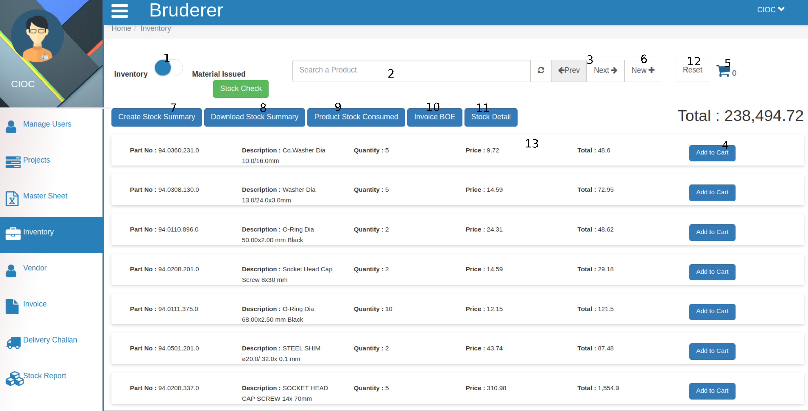
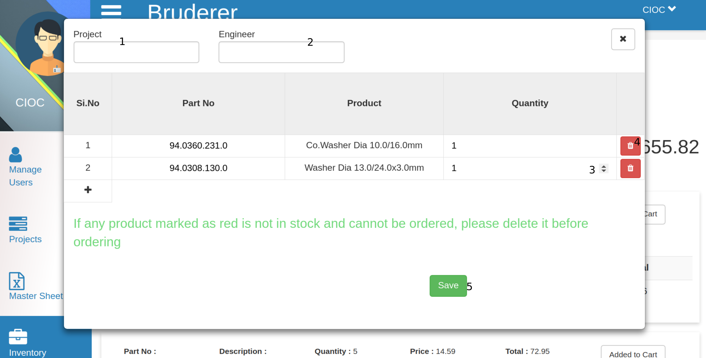
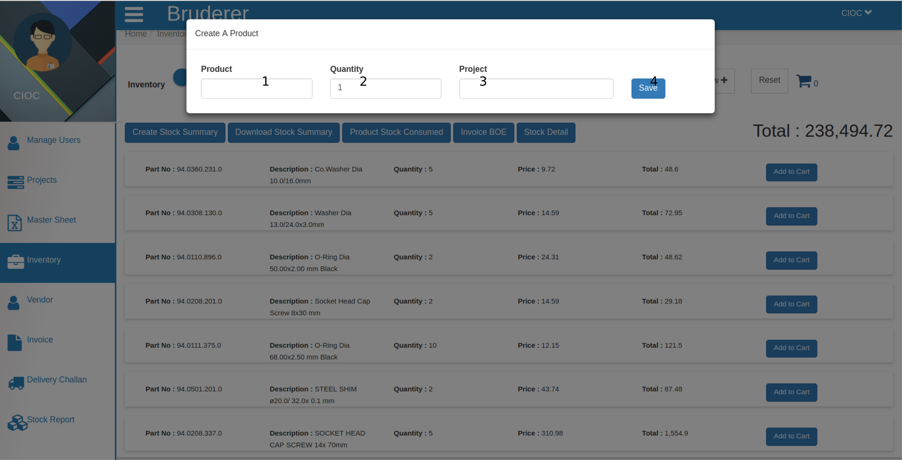
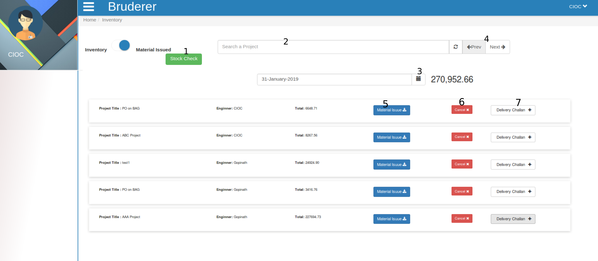
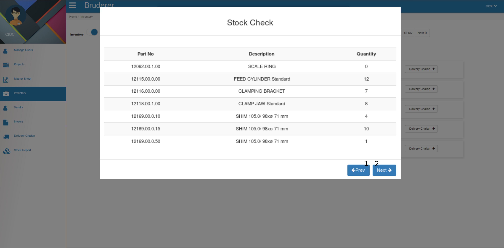
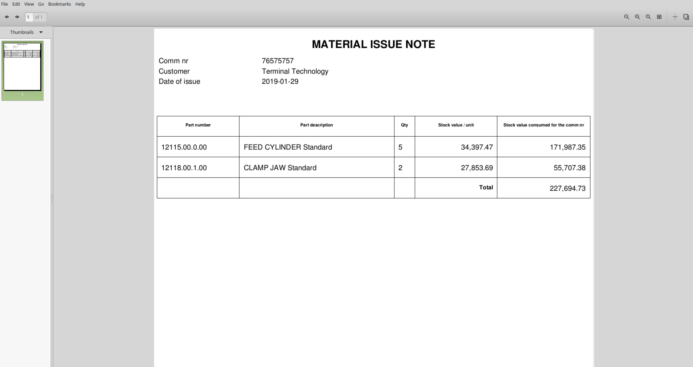
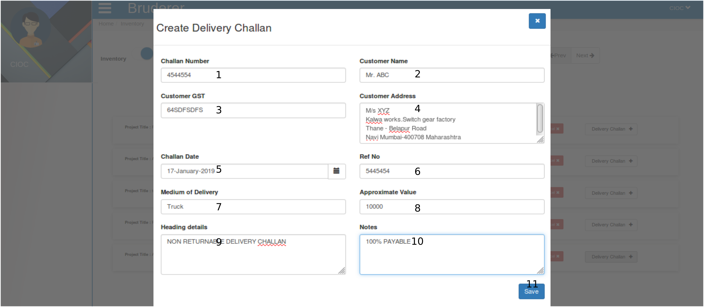
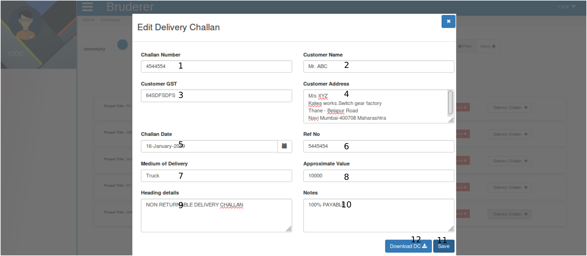
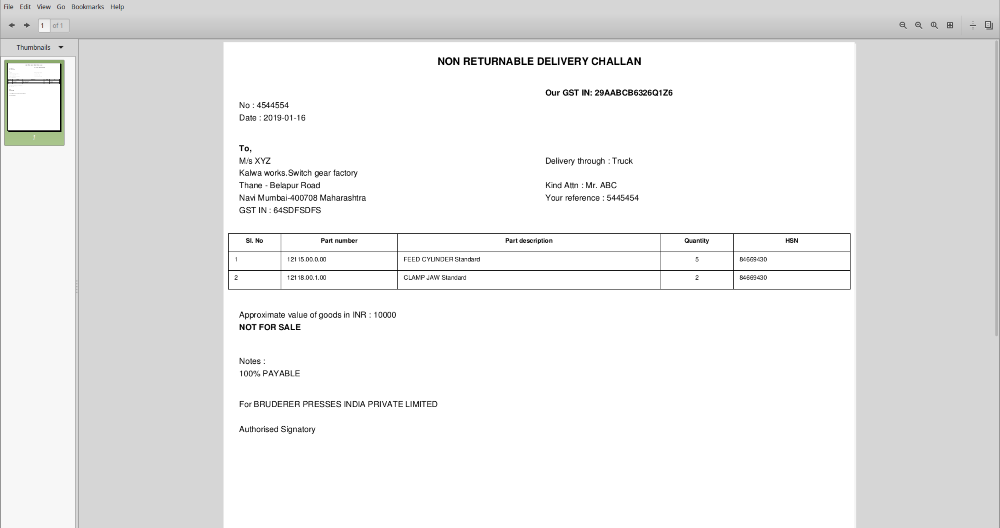

Inventory
=========
 

Above image shows the Inventory tab. Let's explore it.

   1. This is a toggle switch which will allow to switch between two tabs first is **Inventory** and another is **Material Issue** . In above image it is showing the inventory tab, just click on it, it will take you to *Material issue* .

   2. This is a **search** field here you can *search* products.
    
   3. Just right of it there is refresh button to *refresh* your opened pages and at the same place there is *next* and *previous* button too.

   4. Click on **Add to Cart** button to for your customer.

   5. Your added products number will be shown here (at cart icon) and click here .

Now, here you can manage cart too.

     1. Here fill **Project name** .

     2. Mention the **Engineer** name here.

     3. Here you can manage the **Quantity** of particular added product just bring your cursor into that product's Quantity column and change it according to your wish just by entering the value or you can change it by clicking on *Up* and *Down* arrow too. 

     4. If you want to delete the product then click on **Delete** icon.

     5. Now click on **Save** button to save the cart's products. 

   6. Click on new to create a **New** product in inventory.

Now to create a product

     1. Here fill the **Product Name** .

     2. Here set the **Quantity** of that product.

     3. Here set the **Price** of that product.

     4. Now click on **Save** and product is created for inventory. 

   7. Click on **Create Stock Summary** and the details will be saved in stock which you can check by clicking on *Stock Check* .

   8. Click on **Download Stock Summary** and it will download a excel sheet in your system which will contain the stock information.

   9. Click on **Product Stock Consumed** to check the how much product is consumed from stock.

   10. Click on **Invoice BOE** and download the excel sheet and it will show you all the Invoice BOE.

   11. Click on **Stock Detail** and it will show you stock detail in the PDF format.

   12. Click on **Reset** button to reset the inventory.
 
   13. Click on *product* which will show you the product details like Quantity, Price and Total.

Now lets click on the toggle button it will show you the material issued list.

From above tab 

     1. Click on **Stock Check** button to and it will show you the list like give below.

From above tab you can change the stock check list by clicking on **Prev** and **Next** button.
  
     2. This is a search field to search the product which is issued just type the name of the product and it will show below the search field.

     3. Here you can set the date for issued material and it will filter the list of material issued.

     4. This is **Next** and **Previous** button to see the long list of material issued.

     5. Click on **Material Issue** to download the PDF.

which will be in above format.

     6. Click ob **Cancel** button of to cancel that project from the list of material issued.

     7. Click on **Delivery Challan** button to *generate, edit and download* delivery challan.

Here fill the challan form to create the Delivery Challan .

      1. Here enter the **Challan Number** .

      2. Here enter the **Customer Name** .

      3. Here enter the **Customer GST Number** .

      4. Here enter the **Customer Address** .
     
      5. Set the Challan Date either by selecting through Date Picker (which is just beside the text area) or just fill the date in this text area in DD-MM-YYYY format.

      6. Here enter the **Reference Number** .

      7. Here enter the **Medium of Delivery** .

      8. Here enter the **Approximate Value** .

      9. Here enter the **Heading Details** . 
 
      10. Here enter the **Notes** for customer.
      
      11. Click on **Save** button and Delivery challan will be created after that when you will click on *Delivery Challan* you will get.

Here you can edit the saved delivery challan and save it again.

      1. Here you can edit the **Challan Number** .

      2. Here you can edit the **Customer Name** .

      3. Here you can edit the **Customer GST Number** .

      4. Here you can edit the **Customer Address** .
     
      5. Here you can edit the the Challan Date either by selecting through Date Picker (which is just beside the text area) or just fill the date in this text area in DD-MM-YYYY format.

      6. Here you can edit the **Reference Number** .

      7. Here you can edit the **Medium of Delivery** .

      8. Here you can edit the **Approximate Value** .

      9. Here you can edit the **Heading Details** . 
 
      10. Here you can edit the **Notes** for customer.
      
      11. Click on **Save** button and Delivery challan will be updated.

      12. To Download the PDF of delivery challan Click on **Download DC** .

which will be in above format.

 

 

 
   

 

