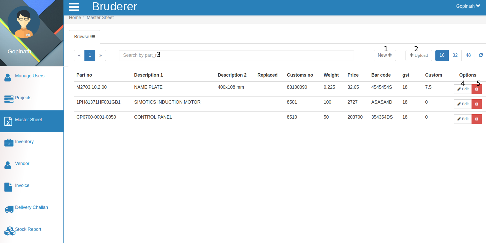
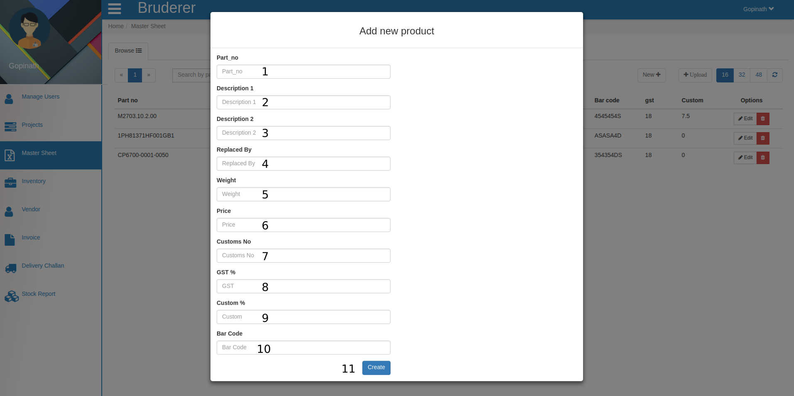

Master sheet
=============

Here you can check all the products and their detail information.

   1. Click on new to add a new product in master sheet.

In the above tab you have to fill the below details.

    1. Enter the **part number** of that product which you want to add in master sheet.
   
    2. Here enter the **description** for the product main description enter in *Description 1*

    3. Here you can enter the detail description about that product *Description 2* will let you know the slight difference between two similar (same named) product.

    4. suppose you were having some product but know you found their alternate so you can keep that info too about that product, for this you have to fill the **Replace By** field with the older product name.

    5. Here **enter** the weight of that product.

    6. Here you will fill (set) the **price** for that product.

    7. Here enter the  **customs number** .

    8. Here enter the **GST %** .
   
    9. Here enter the **Custom %** .

    10. Here enter the **Bar code** of that product .
 
    11. and after filling the product details click on **Create** button and product will reflect in Master sheet as per your creation.

   2. To upload products in bulk amount click on **Upload Button** 

.. figure::  images/uploadproductsheet.png
	   :align:   center

and **Choose** the excel sheet from your computer which is containing products details and click on **Upload** button and these all products which was save in excel sheet will come as the output in master sheet.

   3. This is the **search** field to search the product in master sheet here you can *search product by part number* .

   4. By clicking on **pencil** button you can edit that product details which is similar to adding a new product in master sheet only difference is here the details are already filled you have to change these value and click on save and that product  details will be updated in master sheet.
   
   5. By clicking on **delete** button you can delete that product from master sheet.

