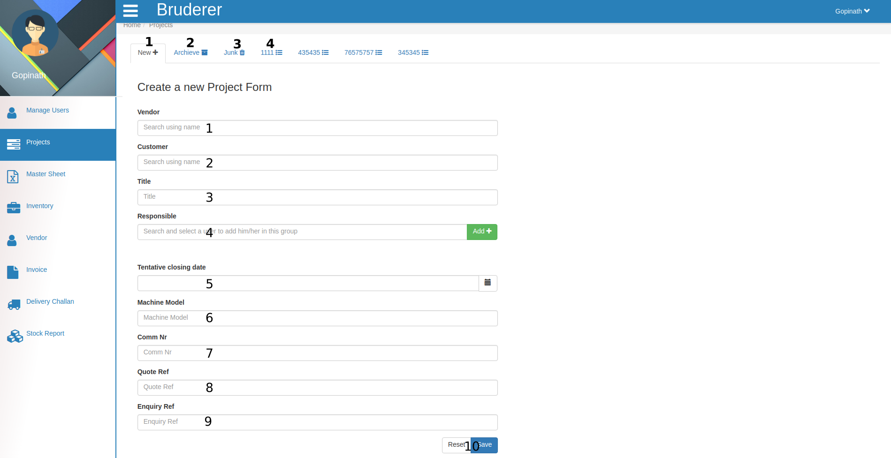
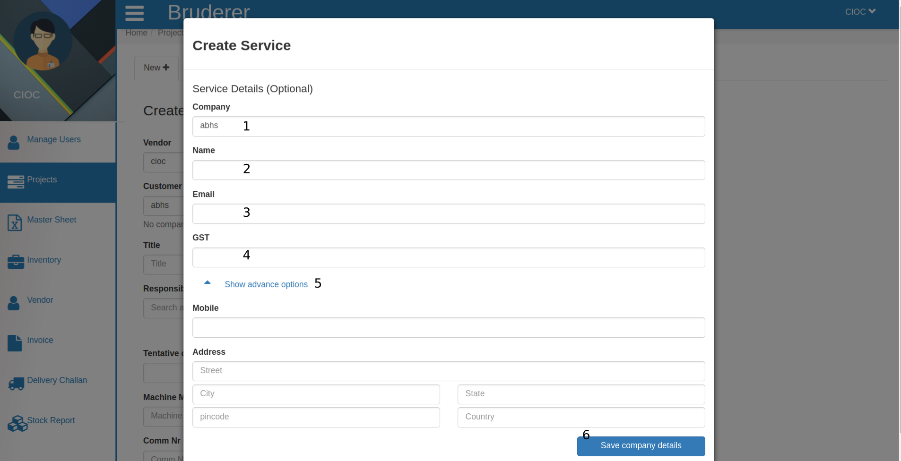
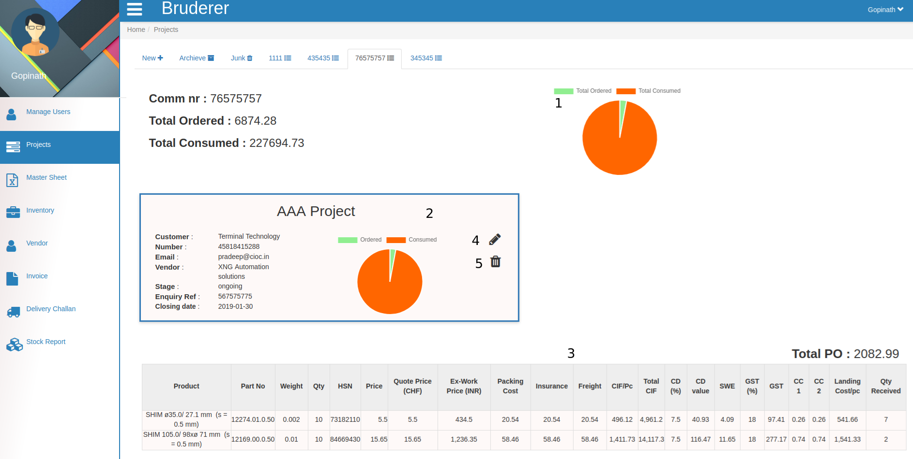
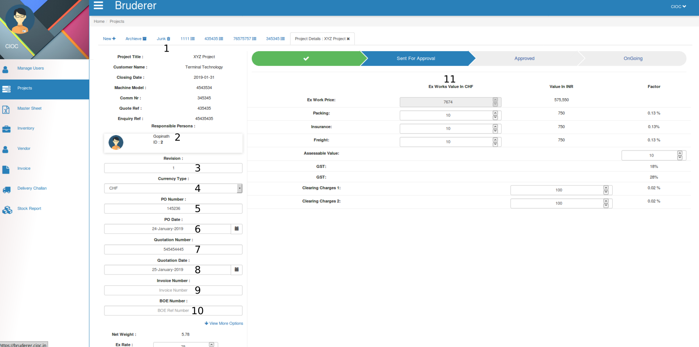
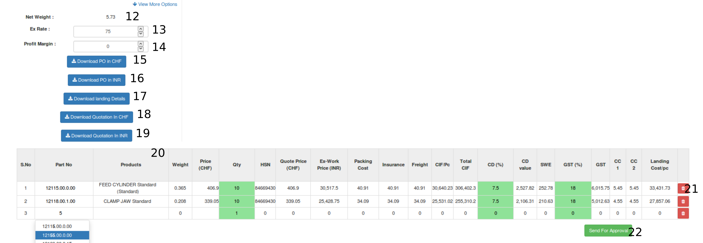
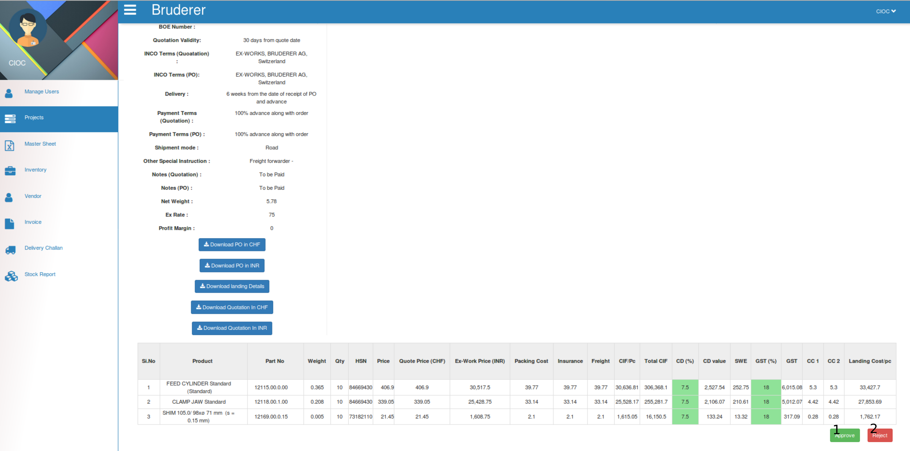
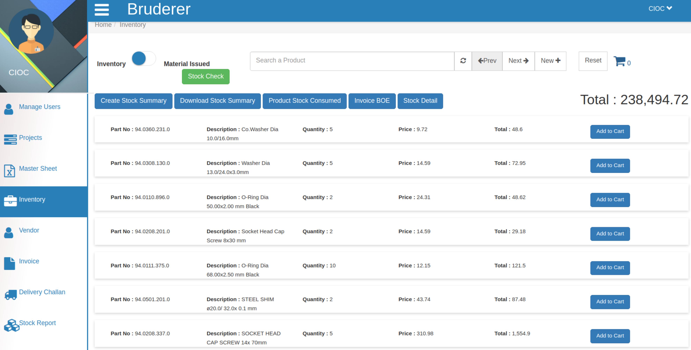

Projects
=========

This is **projects** portal you can call it products as well. Do you want to create new project ?

   1. Click on **New** and just follow the below given steps and you will see a new project (PO) in your inventory. 

    1. Search and select the name of **Vendor** in this text area, it will be appear according to your vendor list from *vendor* portal means that here you can search only those vendor which you had created from your vendor portal.

    2. Fill **Customer Name** here if that customer is already in your list then it will come as popup and you can select it else you can add them as your customer by clicking on **new** button.

.. note::

   New button appears beside Customer name, only when the new customer entry happens .

In the above tab fill the customer details, it is optional but if you want to keep detail of this customer 

       1. Enter **company** name here.

       2. Enter customer **name** .

       3. Enter customer's **Email** here.

       4. Here enter the **gst %** .

       5. Here enter the mobile number and address in below form and

       6. Click on **Save Company Details** to save these above details.

    3. Give the **Title** to your project.

    4. Search and select the **Responsible User** name for this project and click on Add button to **ADD** him/her to this project. 

    5. Set the **Tentative Closing Date** for this project, either by selecting through *Date Picker* (which is just beside the text area) or just fill the date in this text area in DD-MM-YYYY format.

    6. Here fill the **Machine Model** , it means product identification number. 
  
    7. Here fill the **Comm nr** (commission number). 

    8. Here enter the **Quote Reference** .

    9. Here enter the **Inquiry Reference** .

    10. Click on **Reset** if you want *to change* this project information else save it by clicking on **Save** button.

   2. Click on **Archive** to see your archived projects.

   3. Once you moved your project in **junk** it will be deleted after some period of time.

   4. This is one of commission numbers you can check it's details by clicking on it.

In the above tab you can see

     1. Here you see **Total ordered and Total consumed graph** .

     2. Here you see only that particular **project details** .

Here you can see elaborated details of that particular project like..
     
       1. Here you can see the **Project Title** , **Customer name** , **Closing Date** , **Machine Model** , **Comm Nr.** , **Quote Reference** , **Quote Reference** , **Enquiry Reference** and can change as well.
       
       2. Here you can see the Name of **Responsible Person** and their **ID** .

       3. Here you can see the **Revision** number of that project.

       4. Here you can select the **Currency Type** like **CHF, INR, EUR, USD, JPY, GBP, AUD, CAD, ZAR** ( we can addsome more currency type according to you demand) and according to that the invoice and price will be generated.

       5. Here enter the **PO Number** (Purchases Order Number).

       6. Here you can see and change the **PO Date** for this project, either by selecting through *Date Picker* (which is just beside the text area) or just fill the date in this text area in DD-MM-YYYY format.

       7. Here you can see and change the **Quotation Number** .

       8. Here you can see and change the **Quotation Date** for this project, either by selecting through *Date Picker* (which is just beside the text area) or just fill the date in this text area in DD-MM-YYYY format.
     
       9. Here you can see and change the **Invoice Number** .
 
       10. Here you can see and change the **BOE Number** (Bill of exchange number).

       11. Here you can see and change the several values like **Ex Work Price(can not change from here)** , **Packing** , **Insurance** , **Freight** , **Assemble Value** , **Gst** and **Clearing charges** .

And 
      
       12. Here you can see the **Net Weight** .
 
       13. Here you can see and change the **Ex Rate** .
 
       14. Here you can see and change the **Profit Margin** .

       15. Here you can **Download PO** in your selected currency type which you had selected in above at point no 4.

       16. Here you can **Download PO** in INR means in the terms of Indian currency.

       17. Just click here to **Download landing Details** .

       18. Here you can **Download Quotation** in your selected currency type which you had selected in above at point no 4.

       19. Here you can **Download Quotation** in INR means in the terms of Indian currency.

       20. Here in this table you can see and change product details.
 
       21. By clicking on delete button you can **Delete** that particular row from the table.

       22. After this click on **Send For Approval** button and it will be send for approval.

And you will see the above tab here
 
       1. if You are OK with project details click on **Approve** button it will ask you for confirmation click on yes to approve.

       2. if You are not OK with project details click on **Reject** button it will ask you for confirmation click on yes to reject. in the next tab click on **Save** it will ask you for confirmation click on yes and product will be added into your inventory. 

.. note::

   you will see that the **Save** button will be transform into **Archive** button.

Above is added product in inventory.

     3. Here you see the full details in tabular form for that commission number.

     4. By clicking on **pencil** button you can edit that project details which is similar to creating project only difference is here the details are already filled you have to change these value and click on save and that project details will be updated.

     5. By clicking on **Delete** button you can delete the project.

.. note::

   For one commission number there can be many projects.

.. toctree::
   :maxdepth: 1

 

  
    

     

