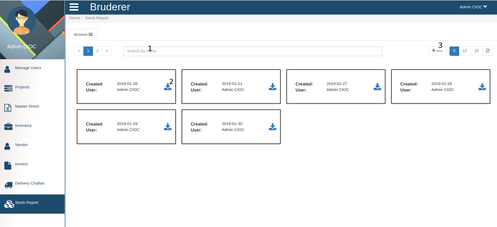

Invoice
========

.. figure::  images/invoice.png
	   :align:   center

Here you can see all the invoices and their details and can manage as well.

  1. Click on **New** button to create a new invoice

.. figure::  images/crtinvoice.png
	   :align:   center

In the above tab you have to fill below details for invoice.

    1. Invoice Number.

    2. Customer PO Reference.

    3. Transporter Name from here on wards fill the Billing Details.

    4. Here the name of billing person.

    5. Here enter the billing address.

    6. Here Enter the GSTN (GST Number).

    7. State

    8. Code (Pin Code)

    9. Click on this check box and make it checked if Billing and shipping address is same otherwise fill that manually.

    10. Invoice Date here

    11. Insurance Number

    12. LR(Lorry Receipt) Number.

    13. Here enter the payment terms.

    14. click on **+** icon to add new row to fill the project details in this table and it will show to several details and total amount on invoice.

    15. Click on **Save** button to save the invoice.

   2. This is the **search** field to search the invoice by Invoice number.

   3. Click on invoice number to check the invoice.

.. figure::  images/downloadinvoice.png
	   :align:   center

In the above tab you can see the invoice.

    1. Here you are seeing the Invoice related details.

    2. IF you are looking for printed invoice then click on **Download Invoice** button it will generate the PDF of invoice you can print it.

   4. Click on Pencil button to Edit the invoice.

.. figure::  images/editinvice.png
	   :align:   center

Editing invoice is similar to creating invoice. only difference is here details are already given you just have to change it.
 
    1. Here is invoice details which you can edit according to your requirement.

    2. Here you can delete the product from invoice by clicking on **delete** icon.

    3. If you want to add some product in invoice click on **+** and fill the required details.

    4. And in the last click on **save** button to save the invoice.

  5. Here you can delete the invoice by clicking on their **Delete** icon.

   

    

Delivery Challan
=================

As you click on Delivery Challan the above portal will open, here you can see the list of Delivery challan.
 
    1. This is a **search** field to search the delivery challan by their **Challan Number**.

    2. By clicking on that challan you can check their details which will look like 

.. figure::  images/downloadDC.png
	   :align:   center

By clicking on **Download DC** button you will be able to download the Delivery challan in PDF format.

Stock report
=============

Above is the view of **Stock Report** .

    1. This is a search field here you can search the Stock report by their name.

    2. Click on **Download** icon to see the stock report for that specific date and name.
 
    3. Click on **New** button to create a new stock report.

In the above form 

  1. Here enter (search and select) the **Product Number** .

  2. Fill the **Quantity** .

  3. And click on **Add** button to add the product in stock.

  4. Click on delete button to **Delete** product from stock.

  5. Click on **Save** button and the product will be added in stock report.

  6. To check or share the stock report you can download by clicking on **Download** button. which will look like

   

 
