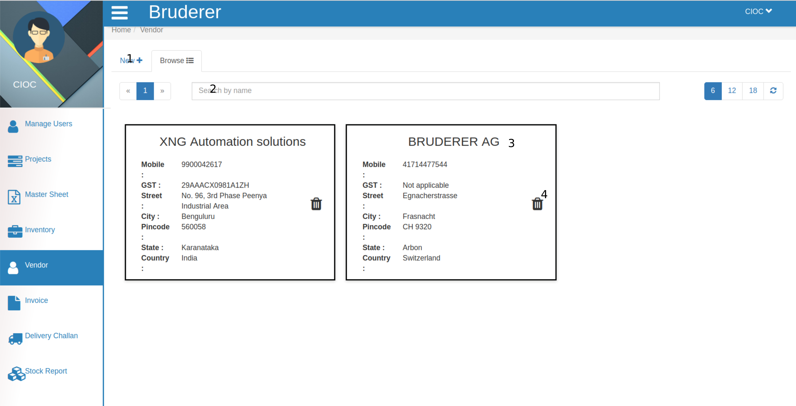
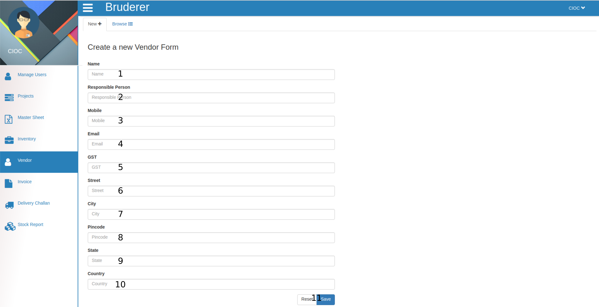

Vendor
=======

As you can see above this is vendor tab. where you can create edit delete and search vendor details.

   1. If you are want to create new vendor click on **New** and below tab will be open.

Now let's start creating new vendor.
  
     1. Here fill the **Name** of vendor.

     2. Here enter the name of **Responsible Person** of that vendor.

     3. Here fill **Mobile Number** .

     4. Here enter the **Email id** of vendor.

     5. Set the **GST** .

     6. From here on wards keep feeling address of vendor like **Street** .

     7. City  8. Pin code  9. State and  10. Country. 
     
    11. Here you have two choice if you had filled wrong data about vendor click on **Reset** else click on **Save** to create new vendor. Now you will see one new vendor in your vendor list.

   2. You can browse **Vendor** either in the appeared *list* or you can **Search** vendor in *search* bar. 

   3. By clicking on **vendor profile** you can *edit* vendor details.

The above tab is similar to *NEW* tab only differences are there is no *Reset* button and this tab fields are already filled so, you have to just edit some information according to your requirement and click on **Save** button so that given information will be updated.

   4. By Clicking on **Delete** button of vendor you can delete that vendor from your vendors list.
  
     
  

 
