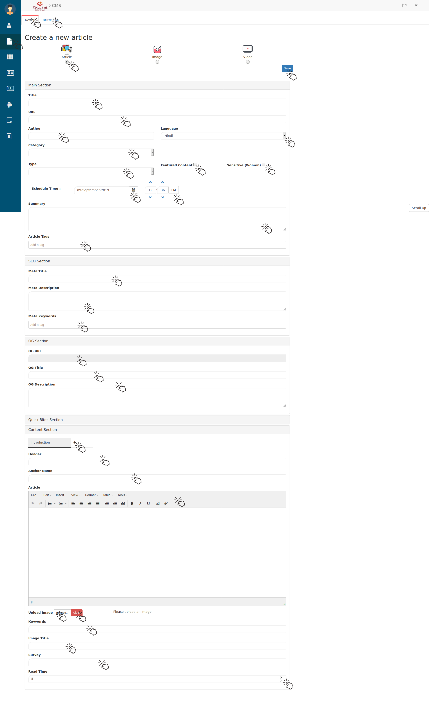

.. _6:

Articles
=============

to manage your Articles/Blogs you have to come to this tab/window by clicking on **Articles** icon (from left side Menu bar). then you will see below tab.

.. _B:

   Articles 

here you can search created articles by filling their details like **Title, Free Text Search, Author, Content writer, Post Type, Category** 

.. Note::

  * You don't have to fill all the areas. 
  * Only * Areas are mandatory and others are optional.
  * Articles will be filtered as per filled fields.

Here you have a toggle button to see(filter) the **Published** and **Unpublished** articles.

.. figure::  images/publishedarticles.png
   :align:   center

   Published Articles Tab 

   Saved Articles 
   
In Above tabs you can perform the **Batch Operation** by selecting the articles and clicking on **Apply to Selected Articles** . for e.g. publishing multiple articles at once.

 * You can publish created/Written article by clicking on their **Publish** button.

 * You can Preview them  by clicking on **Preview (EYE)** icon. which will look like this.

.. _8:

Preview Article
----------------------- 

.. figure::  images/articlespreview.jpg
   :align:   center

   Article's preview

here you can write the **Reviews** in review text-filed and hit on **Submit** button to submit the review for this article.

 * Then you can send it for approval to **Content Manager** by hitting on **Send For Approval** button.

 * After the approval of content manager this article will be published.

To Create an article click on **New+** button from article window.

.. _7:

Creating a New Article
-----------------------

then you will see below tab.

   Creating New article

Here  select **Article** if you are going to write it, select **Image** if you want to upload image article, if you want to publish video click/select **Video** after that

 * Give the **Title** of this article.
 
 * You can fill **URL** too, in-case you have know idea it will be auto filled.

 * Fill the name of **Author** (Optional).

 * select the **language**  by drop down in which language you want to publish this article.

 * Then Select the **Category** for article for e.g. *Addiction, Anxiety* etc.

 * Then select the Content type means either you want to keep it in category of **Featured Content** or **Sensitive Content** .

 * After that select the **Type** of article for e.g. **Blog**

 * You can schedule the publishing time too, for that select the date and time from **Schedule Time** .

 * Below that write the **Summary** of article.

 * Then Write the **Article Tags** for e.g. *addiction, alcohol addiction*

 * Now come to **SEO Section** and here fill the **Meta Title, Meta Description** and **Meta Keywords**. 

 * Below that fill the *OG Section* with **OG URL, OG Title, OG Description** then

 * Come to **Content Section** here first fill the **Introduction** tab in that write the **Header** of introduction, **Anchor Name** below that write the introduction using **Rich text(Article)** section.

 * Below that you can **Upload image** by clicking on *Browse* button to browse and select the image from your computer.

 * Then give the **Image Title**. 
 
 * After introduction you can continue with other sections on article by clicking on **+** button to add a tab.

 * Go on New(Added) tab Give the **Header**, **Anchor Name** below that write the further sections using **Rich text(Article)** section.

 * Below that you can **Upload image** by clicking on *Browse* button to browse and select the image from your computer then give the **Image Title**.  

.. Note::

  * If you want to remove the uploaded images click on **Clear** button(beside the Browse) button.

  * Not every time you have to fill all the fields use it as per your requirements. 

.. _9:

Editing Article
----------------

To Edit the article click on their **pencil (Edit)** icon button then you will see the below tab. from :ref:`B` 

.. figure::  images/editarticles.png
   :align:   center

   Editing Article

Here you can edit all the filled details As per you requirements (Whatever was filled while creating that article). and you can add **Sub Categories** (beside the category drop-down) by selecting from drop-down and hitting on **Add** button.  

.. _10:

Publishing Article
--------------------

from `Articles`_ tab click on that article's **publish** button.

 * To publish multiple articles at once select the articles which you want to publish and select the **Batch Operation** to *publish* and hit on **Apply To Selected Articles** 

Let's see how it looks `from user perespective <https://cadabam.cioc.in/blog>`_ 

 

