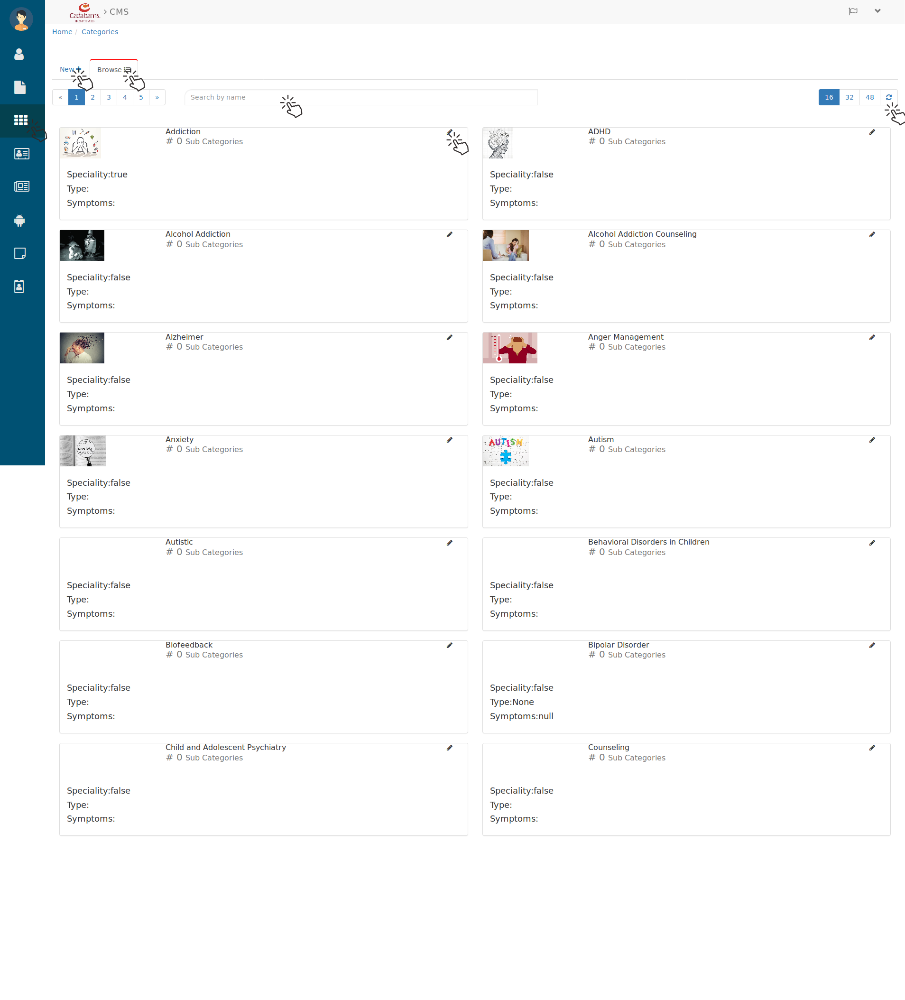
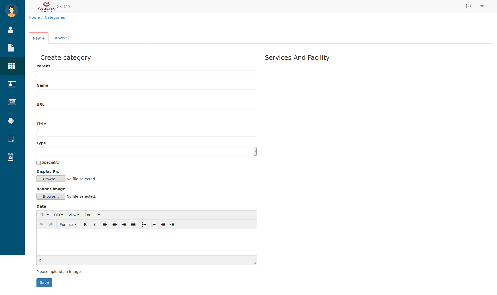
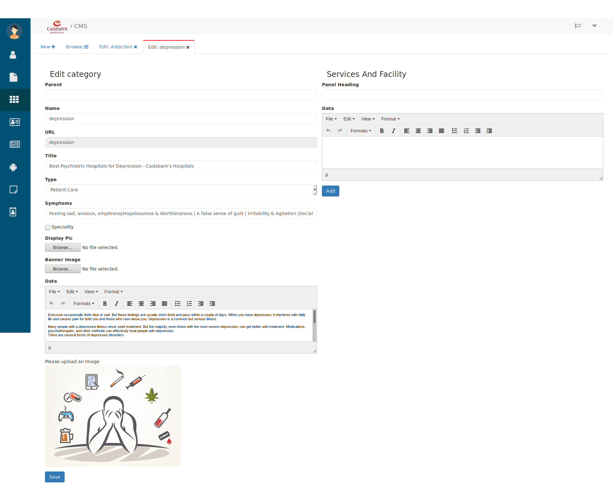

Categories
==============

To manage the categories of treatments and disease click on **Category** icon from menu side bar.

   Categories

Here you can know about the categories and you edit them too.

 * Search the disease category in search bar by entering their name. 

 * Use the page and refresh button to browse the categories.

.. _11:

Creating Category
-------------------

 * click on **New+** to create a new category. by clicking on new you will see below tab.

   Create New Category

Here fill the category details like.

 * Enter the **Parent** Category for e.g. Anxiety.

 * Then **Name** of category for e.g. *Bipolar Disorder*. 

 * Enter the **URL**, if no idea leave it, it will be auto generated.

 * Then enter the **Title** of category below that

 * Select the **Type** for e.g. *Treatments*, *Patient Care* or *None* .

 * check the checkbox of **specialty** if it has else leave it unchecked.
 
 * Upload the **Display Picture** and **Banner Image** to make it more readable for user/reader.

 * Below that write the description about that category in **Data** rich text field.

 * And click on **save** button and category will be created.  

.. _12:

Editing Category
---------------------

To Edit the category click on category's **pencil(Edit)** icon then you will see below tab.

   Editing Category

Here you can edit their all the details like

 * **Parent, Name, URL, Title, Type, Symptoms, Specialty, Display pic, Banner Image, Data** etc.

 * And you can add **Services and Facility** for that enter the **Panel Heading**  and **Data** 

 * then click on **Add** button and the made changes will be updated in that category.  

Let's see how it looks `from user perespective <https://cadabam.cioc.in/category>`_  `or <https://cadabam.cioc.in/>`_

