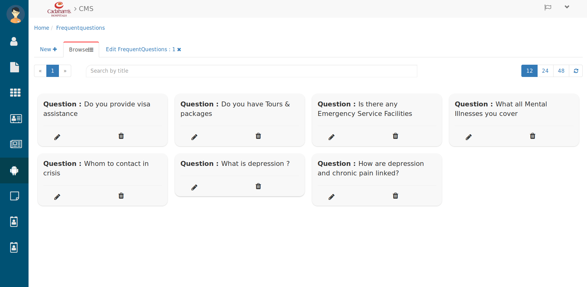
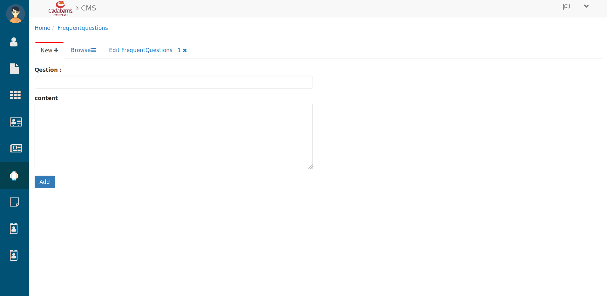
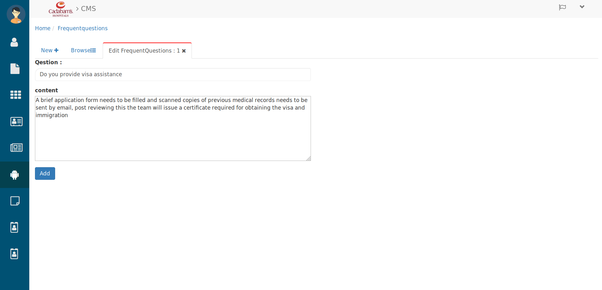

Frequent questions
=======================

Browsing Frequent questions
---------------------------

   Frequent questions

Here you can browse all Frequent questions

 * Search the Frequent questions in search bar by entering their Title. 

 * Use the page and refresh button to Browse/see Frequent questions.

 * To create a new Frequent question click on **New+** then you will see below tab.

.. _17:

Creating Frequent questions
---------------------------

   Creating Frequent Question

Here enter the question in **Question** text-area and below that write the answer of that Question in **Content** text-field.

 * To edit Frequent question click on that Frequent question's **Edit(pencil)** icon. then you will see below tab.

.. _18:

Editing Frequent questions
---------------------------

   Editing Frequent questions

Here you can edit the question and their answer from **question** and **Content** field as filled while `Creating Frequent questions`_ .

 * Then hit the **Add** button and it will be added in news list, which you can check in `Frequent questions`_ tab.

Let's see how it looks `from user perespective <https://cadabam.cioc.in/>`_ then scroll down till **"frequently asked questions"**
