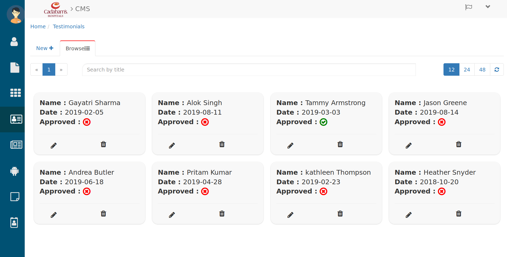
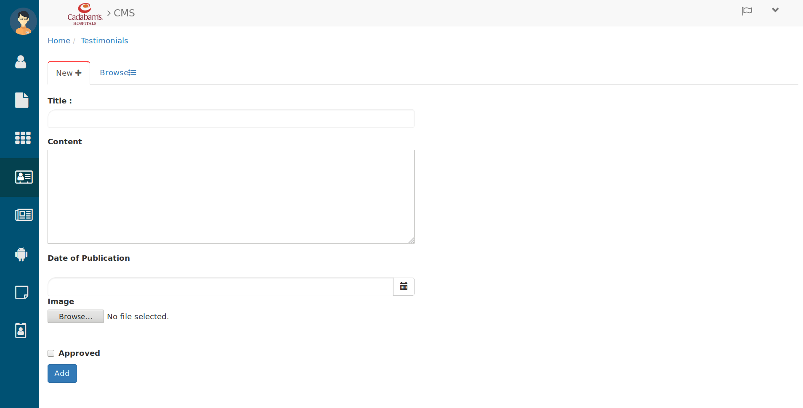
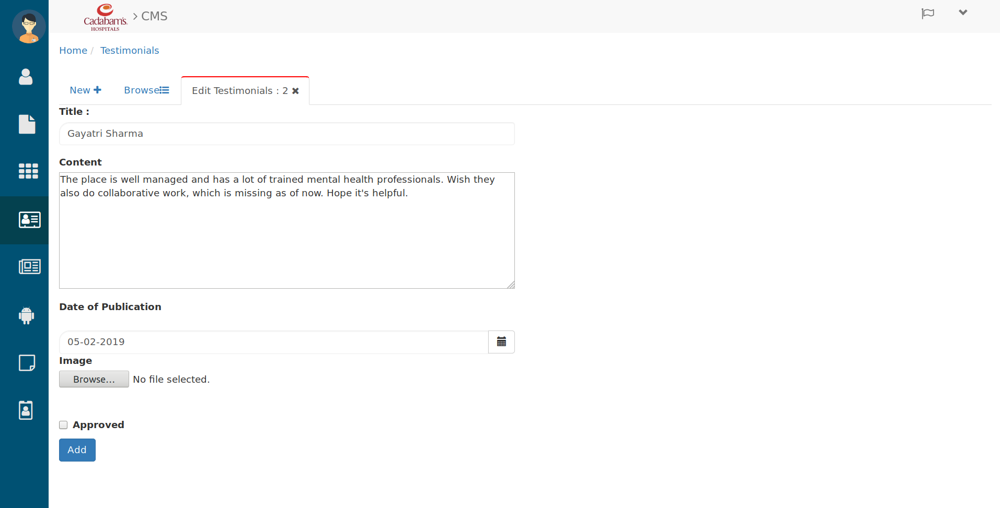

Testimonials
==============

A website testimonial showcases the quality and success of a site’s products or services. Testimonials often come directly from customers and serve as a successful marketing method.

To manage the Testimonials click on **Testimonials** icon from menu side bar. then you will see the below tab.

Browsing Testimonials
-----------------------

   Testimonials

Here you can browse all testimonials

 * Search the Testimonials in search bar by entering their Title. 

 * Use the page and refresh button to browse Testimonials.

 * Here you can see the date and approved status of testimonials.

 * To create a new testimonials click on **New+** then you will see the below tab.

.. _13:

Creating Testimonials
-----------------------

   Creating Testimonials

Here fill the details in below format.

 * Enter the **Title** for new testimonials.

 * write the **Content** in content field.

 * Pick the **Date of Publication** by date picker.

 * Browse the relevant **Image** from your computer by hitting the browse button.

 * check the **Approve** checkbox if you want to approve this testimonial.

 * then click on **Add** button and this created testimonials Will be added in Testimonials list(Browse tab).

 * To Approve testimonials and edit them click on their **pencil** (edit) icon. then you will see below tab

.. _14:

Editing Testimonials
-----------------------

   Editing Testimonials

Here you can edit that testimonial's below details.

 * You can change the **Title** of testimonial, **Content**, **Date of Publication**, **Image**, **Approve** status.

 * after changing the details click on **Add** button. and made changes will be updated in that testimonials.

Let's see how it looks `from user perespective <https://cadabam.cioc.in/>`_ then scroll down till **"what our patients are saying"**

