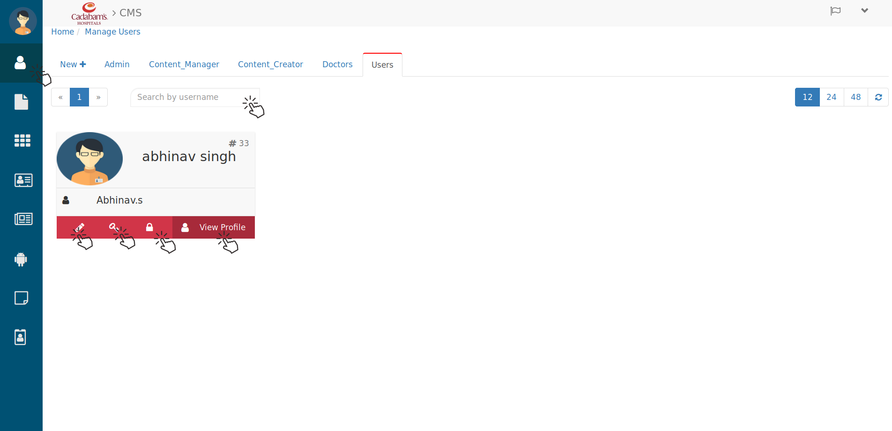
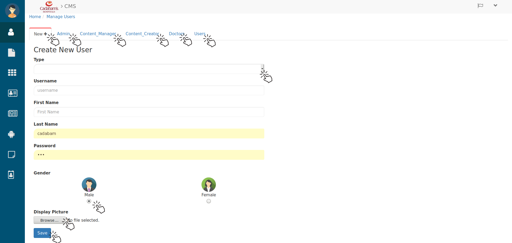
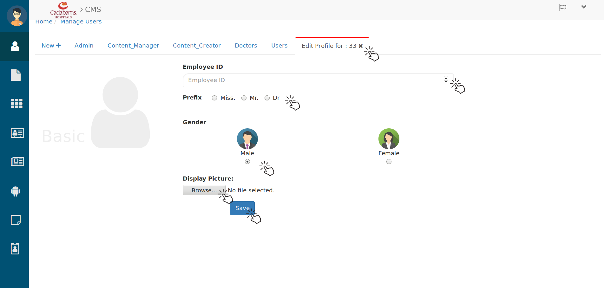
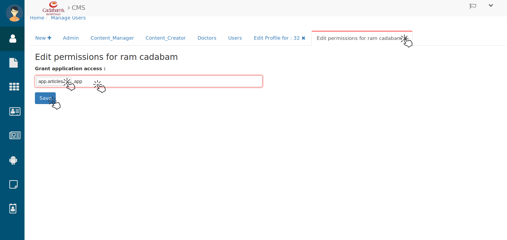
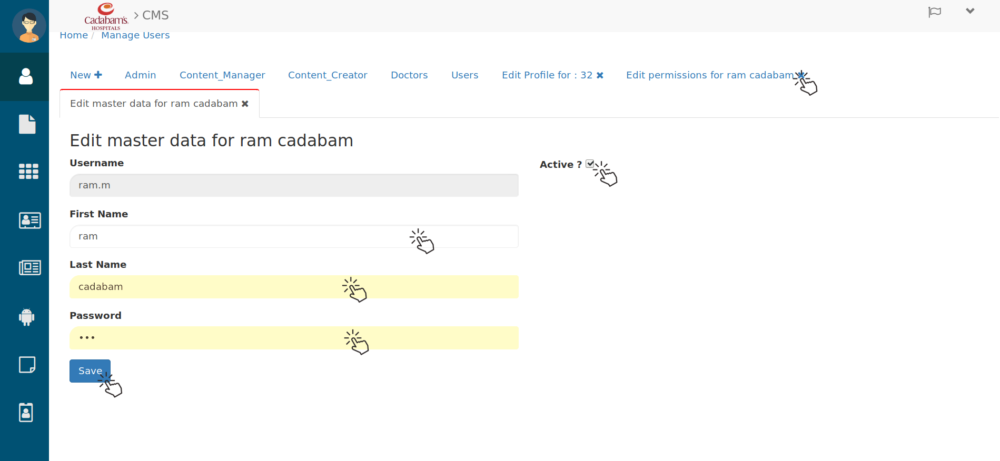
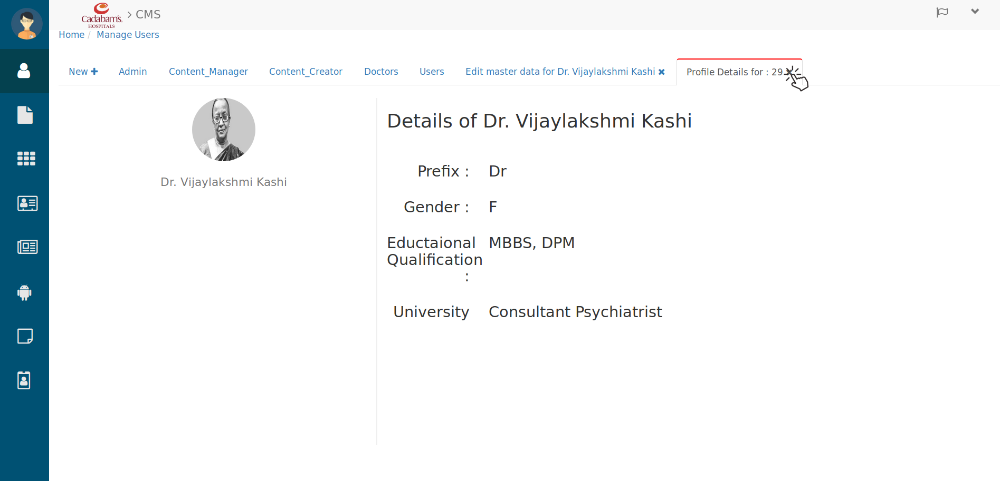
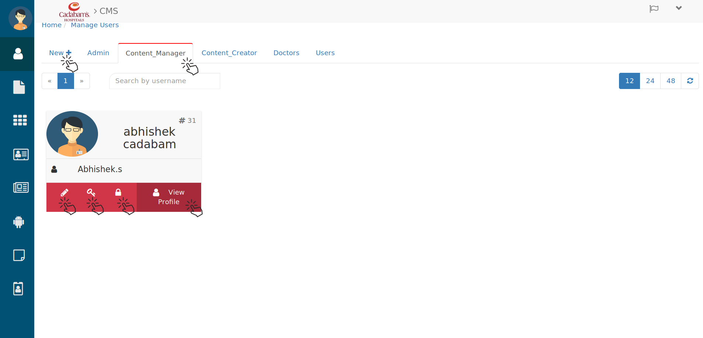
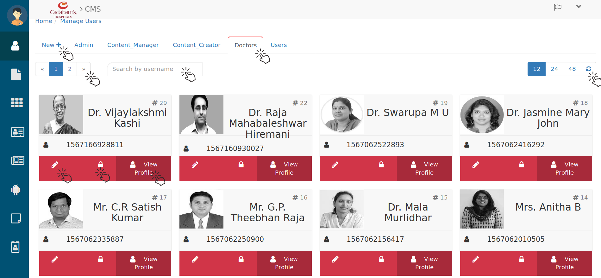
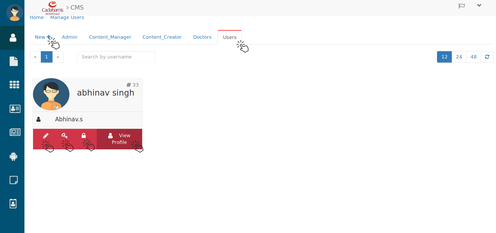

Manage Users
================

   Manage Users

In the left sidebar you can see menu icon by clicking on **Manage User** you will see above page. here you will see all types of user. in the upper left and right corner of the page there is **Next** , **Previous** and **Numeric** button with **Refresh** button By using them you can browse Users. for different type of user there is different tabs which will help you manage them. click on **New+** to create a new user by filling the below form.

.. _1:

Creating New Users
--------------------

   Admin

From here you can create users by their specified category. 

 * From **Type** (drop-down) select the type of user for e.g. *Admin, content_Manager, Content_Creator, Doctors and Users*.
 * fill the **Username** for that user.
 * Here Enter his **First Name** then
 * **Last Name** then **Password** . after that 
 * Select their **Gender Type** then
 * Click on **Browse** button and select the Image file for **Display Picture** and 
 * click on **Save** button and user user will be created which you can see in their specified Tab. 

.. Note::

   In this system **Admin, Content Manager, Content Creator, Doctors** and **Users** are user. 

Admin
---------

.. _A:

   Admin

In Admin tab you can see and Manage admin's profile.

 * In **search** bar you can search them to save you browsing time.
 * You can use page & refresh button to browse them.
 * By clicking on **pencil** (Edit) icon you can edit their details like.

.. _2:

Editing User's Details
++++++++++++++++++++++

   Edit Admin Basic Details.

here you can edit their **Employee ID** Name **Prefix** , **Gender** and **Display Picture** too.
 
 * After updating all the above info click on **Save** button and it will be updated. 

By clicking on **key** icon you will see the below tab.

.. _3:

Editing Permissions for Users
+++++++++++++++++++++++++++++++++

   Grant Application Access (Editing permission for Admin).

From here you can specify the access area for every Users.
 
 * Search that user and click on their **pencil** icon then you will see above tab then in this search field click and type the name of the area which you want to allow access for him and hit enter.
 * by the search and select method and clicking on **save** button you can **Grant application access** for that user.

By clicking on **Lock** (Edit master data) icon you will see below tab. form here you can edit Master data of that user.

.. _4:

Editing Master Data for Users
+++++++++++++++++++++++++++++++++

   Editing master data of users.

From this tab you can edit user's **First Name, Last Name** and **Password** by filling new value, 

 * If you want to Block this user (click) Uncheck the **Active** Checkbox if not click check (Click) on **Active** checkbox.

 * and after doing such changes click on **Save** button and made changes will be updated for that user.

By clicking on **View Profile** you can see that user's below details.

.. _5:

View User's profile
+++++++++++++++++++++++++++++++++

   View User's Profile. 

By clicking on **Content_Manager** tab you can see(browse) their profiles.

Content Manager
------------------

   Content Manager

Content Manager is also a type of user, so the process of managing them also is similar to :ref:`A` User. 
And same for the **"Content Creator" "Doctors" "Users"** .

Content Creator
------------------

   Content Creator

Doctors
------------------

   Doctors

The doctors you have created and edited from here you can see those changes `from user side <https://cadabam.cioc.in/doctor>`_ 

Users
------------------

   Users

.. Note::

  * According to type of user they will be able to access the areas. 
  * And it also depends on **Granted Application Access** for them.
   

