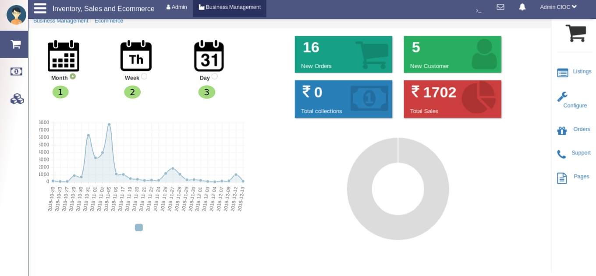
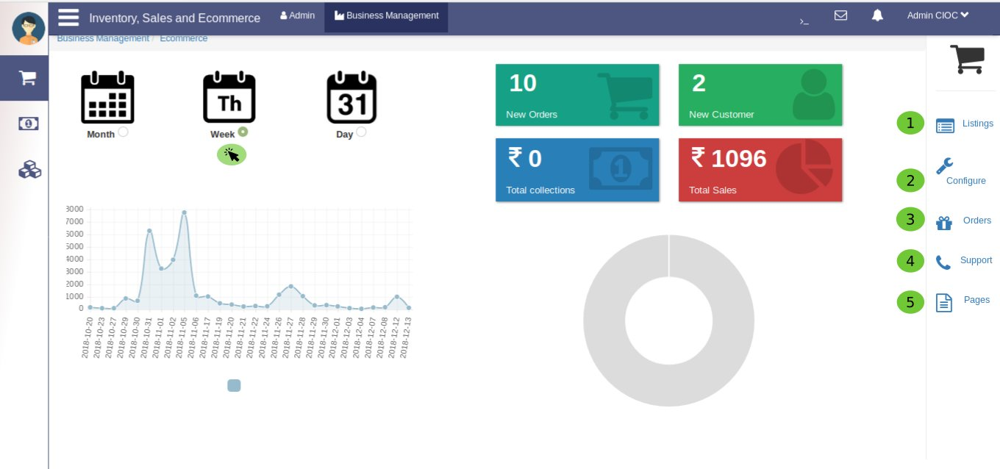

Business Management Ecommerce
=============================

Now you are on the subportal of *Business management* which is **Ecommerce**. here also we have created an easiest tool to analyize your Business. which will give you the analyized data of you business

   1. for **Monthly** 
   2. for **Weekly** and
   3. for **Daily** as well.

The above image is an example of **weekly** analyized data. In the same way you can check for **Day** too.

Now let's see the major settings of *Ecommerce* portal:

.. toctree::
   :maxdepth: 2
   :caption: Business Management Ecommerce Features:

   listing
   configure
   orders
   support
   pages
