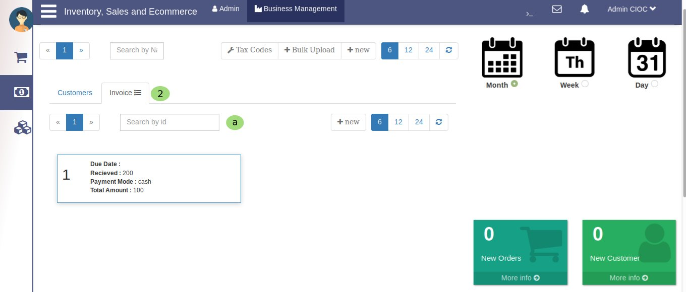

Business Management Point Of Sale
==================================

.. _38:

.. figure::  images/BMpos.png
   :align:   center

   POS (Point of sale)

You clicked on pos so you are here now,

   1. It has taken you to **POS** (point of sale) portal which is subportal of *Business Management*. Now its time to know POS in detail.

   a. Here you can check you *point of sale* as per **Month** . You can check prticular months pos just select the month data will display on same tab.

   b. Here is same feature for **Week** too.

   c. In the same way you can check *pos* for **Day**.

   d. Here admin can search **Customer** by their *Name*.

.. _39:

.. figure::  images/BMposcust.jpeg
   :align:   center

   Customers
 
Above image is example of search Customer by Name.

   e. Here admin can search **Invoice** by their *Id*.

.. _40:

   Invoices

Above image is example of search Invoice by Id.

  2. Clicking on it will show you the Product details.
 
  3. Click here to edit the product it will show you details of that product which will reflect in *Manufacture* section. Here you can change the product details and quantity as per your requirements. It is similar to :ref:`Edit Product` so just try once you will come to know how it works.

 
