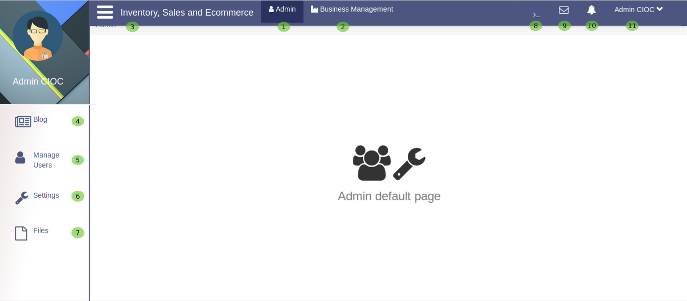
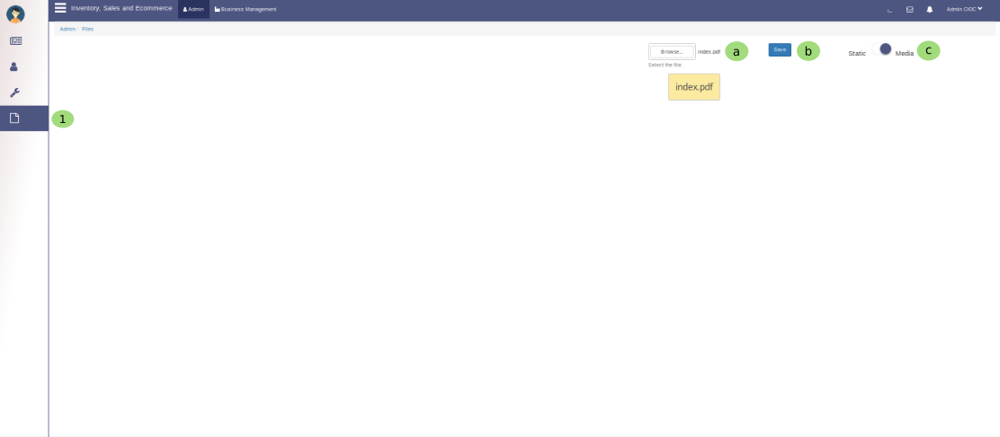

admin loged in
==============

Let's see what admin can do ?

.. _17:

   Admin Portal

Now you loged in as **Admin** so you can configure the several parts of this website, Let's discuss one by one.

   1. this is your **admin** portal now its time to explore it.
   2. To manage your bussiness in easiest way let's go through **Business Management**.
   3. You will get several Business Management options like Ecommerce, Point of sale and product inventory by 

clicking on |bmoptions| icon.

   4. This is **Blog** section of website, here admin can post some blogs and can manage it too.
   
   5. This will help admin to **Manage Users** we will see in details on seprate portal.

   6. Here admin can **setting** for most part of website. let's see it on setting portal.

   7. Here admin can **Save Files** related to their bussiness. we explore it too on Save file portal.

Save Files
-----------

.. _18:

   Saving files

Here you can save the useful files

   a. Here **browse** the file from your computer.
 
   b. select it and Click 0n **save** button to save it.

   c. Here you can set the type of Files if it is **static** then turn the toggle button in *static* side if it is **media** file the turn the toggle button in *media* side.

   8. Here admin can right some queries ``@aks`` to search their user like **akshay sinha** and can chat with searched user.

   9. Here admin can read **Messages** and send too.

   10. Here admin will see all the **notifications**.

   11. Here admin will come to know about some more options for admin profile like **Setting, About and Logout**.

.. toctree::
   :maxdepth: 2
   :caption: Contents:

   businessmgmt
   blog
   mng users
   globalsetting
   adminprofileoptions
   
	   
