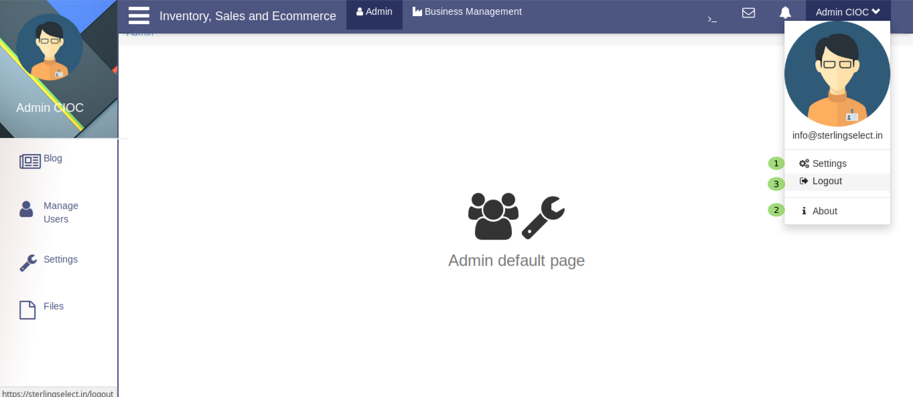

.. _58:

Admin Profile Options:
======================

When you click on admin you will see a popup like in above image.
  
   1. Click here to manage **Admin Stting** .

.. _59:

Admin Setting
--------------

Here admin can change several things

    a. Here select the **Display Picture** .

    b. Here admin can change the color of **main theme** .

    c. Here admin can change the color of **highlight** color . and in the below form admin can change the password, for this enter the old password in old password textarea, enter the new password in new password textarea, confirm the new password by re-entering the new password in the confirm password textarea.

    d. Click on **Save** button to update the setting and all the changes will be updated.

    e. Click on *back arrow* symbol to Exit from this tab.

   
   2. Click here to see **About Admin** .

.. _60: 
    
About Admin
------------

When you click on **About Admin** you will see the above tab.

    3. Click on **Logout** to logout from admin side.

   
