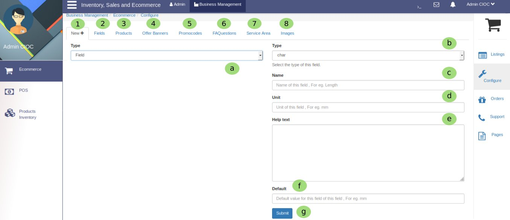
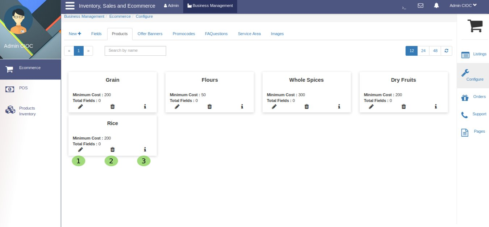
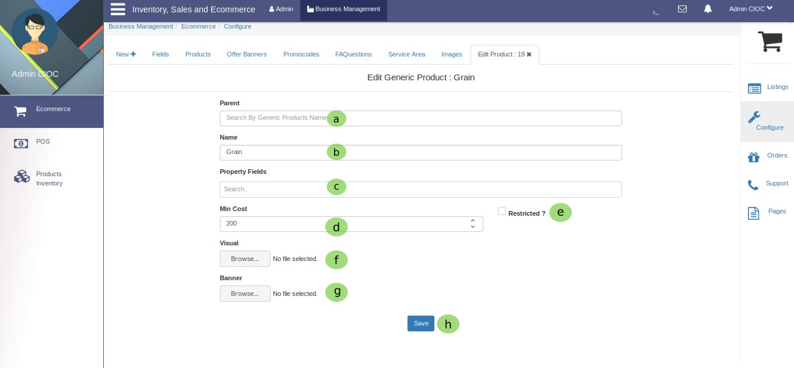
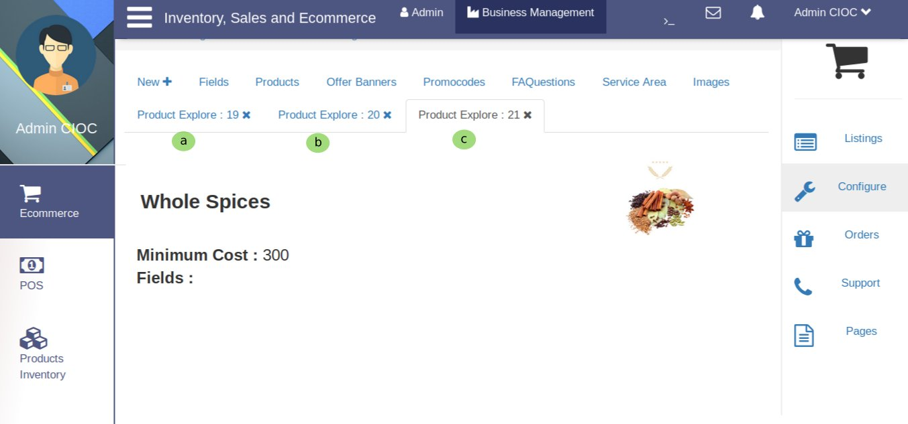
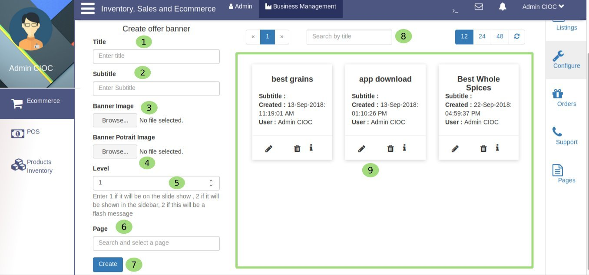
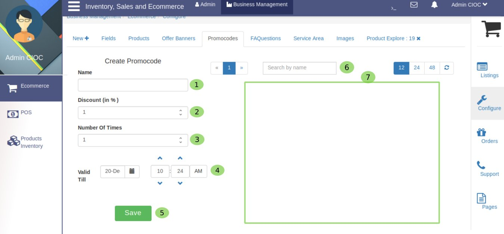
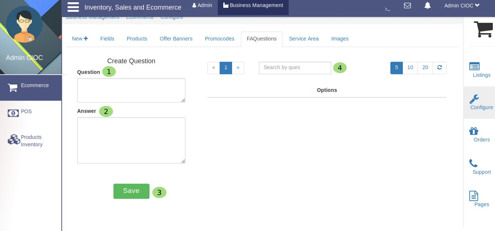
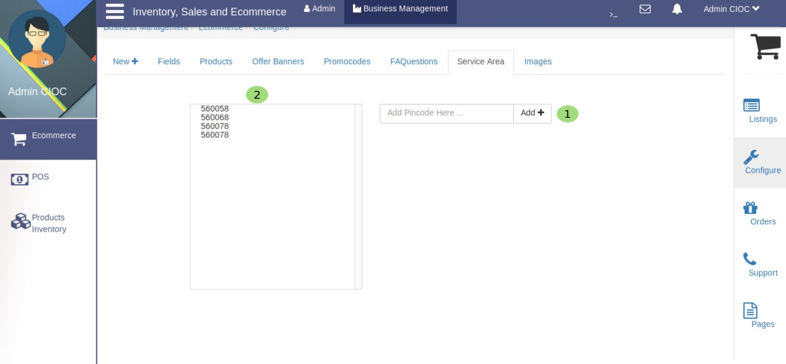
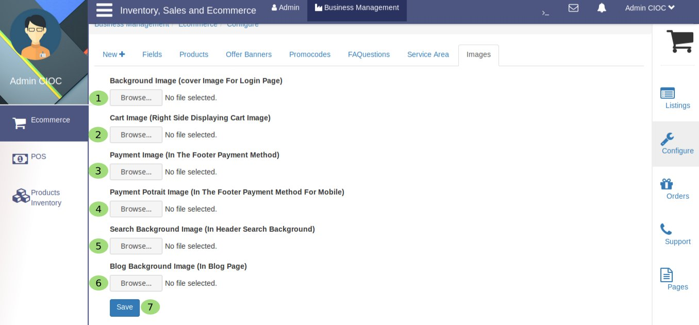

Configure
=========

.. _26:

 
  Configuring your website

Let's see **Configure** portal.

   1. Here you will configure the *Fields or Products* by clicking on **New**.

Here

    a. This is a dropdown portion where you will get 2 options **Filed and Products** , choose which one you want to configure for e.g let's select ``fields``.

    b. This one is also a dropdown portion here you will get options to set the **Type** like *char, float, boolean, date* etc.

    c. Here you will set the **name of the field** for e.g. *length* etc.

    d. Here you have to set the **Unit** of the field for e.g. *mm* (milimeter).

    e. Here you can write some helpful **Text** which will give some information about the field.

    f. Here you will set some **Default value** for specific field for e.g. *mm* (milimeter).

    g. Now you are done just click on **Submit** and your field is set.
  
   2. Here you can see your configured **Fields** .

   3. Here you will be able to *see and configure* the **Products** .

Products
--------

.. _27:

   
   Managing Products

Here you will get following options:

     1. To **Edit** genric product just click here and you will see: 

.. _28:

   Edit Genric Products
    
Here you have to follow the following steps:

    a. Textarea **Parent** is to fill genric prduct name.

    b. Fill the product name for e.g **Grain**.
  
    c. Here you can specify the **Property Fields**.
 
    d. Here you can set the **Min Cost** of product.

    e. If you will enable **Restricted** for fixed minimum cost it will not direct for sale.

    f. Here you can set image which will be **Visual** for product.

    g. Here you can set **Banner** image.

    h. To save these all editing click on **save** .

    2. if you want to **Delete** then click here.
 
    3. To **Explore** product click here and you will see:

Here you will get seprate tab for each product as you can see in above image **a**, **b** and **c** are pointing those **Tab**. You can switch between these tabs just by clicking on it.

   4. It will take you to **Offer Banners** where you can configure the offers.

.. _29:

   Creating Offer Banner

Here

    1. you fill **Title** of *banner*.
 
    2. Here you fill **Subtitle** of *banner*.

    3. Here you set the **Banner** Image (in landscape mode).

    4. Here you set the **Potrait Banner** Image (in landscape mode).

    5. Now you can customise the **Level** of images(banners) for e.g Enter 1 if it will be on the slide show , 2 if it will be shown in the sidebar, 3 if this will be a flash message.

    6. Now its time to set the **Page** where you want to show this banner. 

    7. Now click on **Create** and your banner is ready to visual on your website.

    8. Here you can **Search** your created banner.

    9. In this section your created banner will be appear, where you can *edit, delete and explore* it.

   5. By clicking here you will be on **Promocodes** browser here you can configure promocodes.

.. _30:

   Creating Promocode

Here

    1. Set the **Name** of promocode for e.g NEW50

    2. Set **Discount %** for e.g 5%.

    3. Limit **Number Of Times** for this promocode for e.g ``1`` bcz it is only for new user.

    4. Here you have to set **Valid till** date and time.

    5. Now click on **Save** butoon to create your promocode.
 
    6. Here you can **Search** your created promocode by their name.

    7. In this section your created promocode will be appear where you can *edit delete and explore* your promocode.

   6. By clicking here you will be on **FAQ Questions** browser here you can see  ask and answer the FAQs.

.. _31:

  
    Frequently Asked questions and answers about Your Website.
   
Here: 

    1. You can write **Question** which may come in user's mind.

    2. And you provide them **Answer** too, To solve some queries and make it easier for your customes.

    3. Click on **Save** it will be appear in FAQ section.  
  
    4. Here you can **Search** the posted questions *by question* to check their answer.

   7. Here you can check your **Service Area** and Add too.

.. _1:

 
   Configuring Service Area

Here you can specify your service area:

     1. In this textarea fill the pin code of the area which you want to add and click on **Add** it will be added in your service area.

     2. Here you can check your **Service area** and delete too.

   8. This is your websites **Images** browser here you can set the image for different different portions of website.

.. _32:

    Setting Images for your website

Here you can set images for your website's different different portions:

    1. Here set **Background Image** (cover Image For Login Page).

    2. Here set **Cart Image** (Right Side Displaying Cart Image).

    3. Here set **Payment Image** which will be appear in the footer section of website.

    4. Here set **Payment Potrait Image** for mobile site.

    5. Here set **Search Background Image** which will be appear in Header Search Background.

    6. Here you can set **Blog Background Image** for Blog Page.

    7. Click on **Save** button and images will be saved.

    
