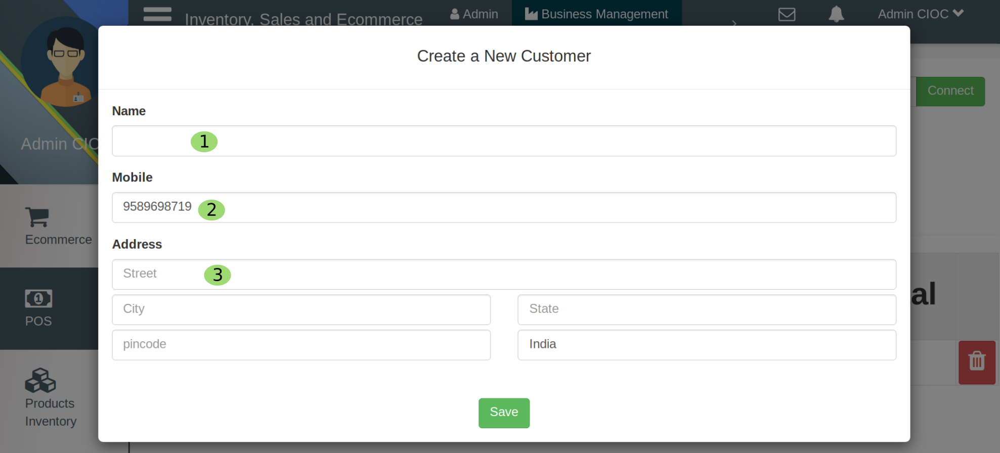
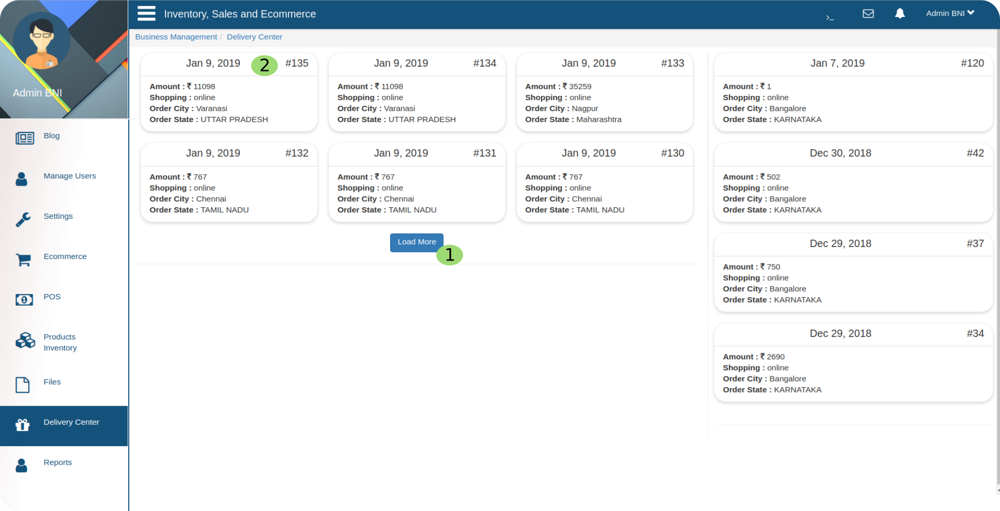

FAQS
====

Here some general questions:

   1. How to register to this website ?

 Ans:- :ref:`Registration`

   2. How to login to this website ?

 Ans:- :ref:`Login`

   3. How to Use customer support ?

.. |werhere| image:: images/werhere.png

Ans:- First you enter in the website, click on *Register* it will take you to registration page there you will get many numeric marked point,
near the point no. 6 you will get **online** or |werhere|  click on online and you can :ref:`Chat with customer care` .

Some helpful questions & answers for Admin
--------------------------------------------

   1. How to configure the whole website ?

 Ans:- Do you want to learn how to configure whole website ? For this first you have to login as admin by clicking on **Admin login** it will take you to the portal named *Admin loged in* then you have to follow the link :ref:`admin loged in` .

   2. How to Control your business through this website ?

 Ans:- As per your Question it seems you are admin so, First Login as admin :ref:`Login` , Then click on **Business Management** it will take you to business management portal  and follow the instructions :ref:`Business Management` .

   3. How to check **New orders** / **New Customer** / **Total Collections** / **Total sales**  of *Online and Offline Business* ?

 Ans:- Click on :ref:`Business Management` and follow the guidelines to find your answer.

   4. How to login to this website ?

 Ans:- :ref:`Login`

   5. How to manage **Orders** ?

 Ans:- :ref:`orders`

   6. How to **change** or **check order status** ?

 Ans:- Go to Business Management > Business Management E commerce > click on orders and follow :ref:`orders` at the point no 7 you can manage the status of orders.

   7. How the **Delivery process** work out ?
 
 Ans:- For this you need one app which will be in delivery person side. first he will login to that app

.. figure::  images/dblogin.png
	   :align:   center

here 

    1. Here Delivery person will enter the **Username**.

    2. Here **Password** and

    3. Click on  **Login** button. Once he loged in then 

.. figure::  images/dblogin1.png
	   :align:   center

Here he will scan the product's *Bar Code* while receiving the product then product status will be *ongoing* or out for delivery as he reached to customer to deliver the product again he will scan that product and then after the selection of payment mode the particular product status will be change (Ongoing to Delivered) . 

.. figure::  images/dblogin2.png
	   :align:   center

here he will select the **mode of Payment** by clicking on this it will be added in the payment mode list which is currently in background.

.. figure::  images/dblogin3.png
	   :align:   center

Here he can see the order details, how many is *completed* and how many is *ongoing* .

     1. By sliding right he can check the *previous* date delivery details.

     2. Currently he is on *current* tab. As the delivery person will update here it will reflect in admin side too and admin can manage it from :ref:`Orders` section.

   8. How to manage **online orders** ?

Ans:- Go to business management > POS you will see the below tab

.. figure::  images/posordermng.png
	   :align:   center

Here
 
    1. Enter customer **moblie number** and click on search, it will show that customer order details.

here
     1. Enter **User Name** .

     2. Enter **Mobile Number** .
 
     3. Here fill the user **Address** and click on save button it will create a new user in your user list.

Then you will see something like

Above tab is showing you the user details and his order, here you can raise the order or delete too according to you requirement. If you do not have to do any change click on **Pay** . It will take you to payment process.

Now 
  
     1. Select the Payment options either cash, card or Wallet (E-Wallet).

     2. If customer is willing to pay on delivery then click on **Cash on Delivery** .

     3. After completing the payment process click on **Confirm And Print** button to generate the printed  bill of order.

    2. Here enter your **device id** and click on connect and your device will be connected to your portal.

    3. Here fill the order details like *Item description* , *Quantity* , *Rate(Rs.)* and it will show the subtotal in next column.

    4. Click on **+** button to create new row for more order and fill this row if required (if further order is there).
  
    5. Here you can **delete** the particular order.
  
    6. If you have to delete all the order of that particular user click on **Reset Form** .

    7. This is back button to go back to previous portal.
  
    8. Click on pay if payment is done by user

   9. How to activate user account ?

 Ans:- follow the path *Login > Admin loged in > How to Manage Users* and then go to :ref:`Edit Permision For User`.

   10. How to handle **customer complain** if *transaction is not completed* and order is not placed ?

 Ans:- Go to *Business management > Business Management Ecommerce > Orders* then :ref:`Approve order` .

   11. How to **Save Files** ?

 Ans:- :ref:`Save Files` .

   12. How to manage **Delivery Center** ?

 Ans:- To manage *Delivery Center* Click on Delivery Center then you will see the below tab.

now

       1. Click on **Load More** to see more *Delivery Center* 

       2. Click on that *delivery center* whose order details you want to check then you will see the below tab.

.. figure::  images/dcorderdetails.png
	   :align:   center

Now in header section you can see **Order Details(16 mins)** it is showing when the order was created.

   1. Click on **Generate Manifest** button to *Generate Manifest* for this order.

   2. If you are feeling the *Order Details* is correct and it is good to go, then click on **Approve** to approve this order for this it will ask you for confirmation then click on *Yes* button and the order will be approved, in the same way if you have to reject the order the click **Reject** and give the confirmation by clicking on *Yes* and order will be rejected.

   3. Click on **Logs ^** button to write the log for that order then 

   4. Write the logs in **Logs History** text-field and click on **Submit** button and the logs will be updated for this order.

   5. If you want to *delete* the particular product from this order list then click on the **Delete** icon of that particular product and then that product will be deleted from list.
   
   6. If you want to **add** more product in this order then click on the **Add +** button.

.. figure::  images/addnewproductincurrentorder.png
	   :align:   center

now

    a. Click in the **Product** text-field and type the product name to search and select product

    b. Enter the quantity of that product in numbers.

    c. Click on **save** to save and product will be added in that order list.

   13. How to check **Reports** *(Sales Reports/Delivery Reports)* ?

 Ans:- To check *sales or delivery reports* click on **Reports** in Business Management then you will see below tab

.. figure::  images/reports.png
	   :align:   center

Click on the *Pencil* icon button it will take you to edit that product in below format.

    1. Click on **Sales Reports** to check *sales reports* .

    2. Click on **Delivery Reports** to check *delivery reports* .

    3. Select the **From Date** to **To Date** to check the reports for that specified days and reports will be appear below.

    4. Click on **Download** button to *download* the reports in excel sheet format.

   14. How to **limit the quantity** of selling products for buyers ? 
 
 Ans:- To limit the quantity goto **ERP** portal and then click on **POS** then click on **Back** button(beside the reset Form button) there you will see the products, hover the cursor over product then you will see below view

Now click on the *Pencil* icon button it will take you to edit that product in below format.

.. figure::  images/limitprodquant.png
	   :align:   center
 
And set the quantity in **Order threshold** and that will be the limit.

   15. How to change the image of product with their relative unit size ?

 Ans:- which product has multiple pack, it will has a drop-down below price as in below tab.
 
.. figure::  images/chngprodunits.png
	   :align:   center
  
Here if customer selects the different size of pack the display image will change accordingly.

   16. How to set the offer price ?

 Ans:- To set the offer price goto **ERP** portal and then click on **POS** then click on **Back** button(beside the reset Form button) there you will see the products, hover the cursor over product then you will see the *Pencil* icon button it will take you to edit that product in below image format.

.. figure::  images/limitprodquant.png
	   :align:   center

Here set the **MRP** and **Selling Price** if selling price will be less then MRP then it will show in offer price. if you set the selling price more than MRP then it will show you message of invalid entry. if MRP and Selling Price will be same it will show as normal price.

   17. How to show products on sale portal(To Customers) ?

 Ans:- To show products on sale portal(To Customers) goto **ERP** portal and then click on **POS** then click on **Back** button(beside the reset Form button) there you will see the products, hover the cursor over product then you will see the *Pencil* icon button it will take you to edit that product in above image format. You will see a checkbox labelled by **Available Online** check that box set the product type and set the quantity for that and click on **save** button it will be shown to customers. 

   18. How to set offers ?

 Ans:- To set offers goto *Edit product* (as you have done for above question) there set the MRP and Selling Price and (in below) **Special Offer** (Name), **Description** and click on **save** button. 

   19. How to add  your service area ?

 Ans:- goto :ref:`1` and add the pin code of that area.

Some helpful Questions & answers for Users
-------------------------------------------

   1. How to **Login** to this website ?

 Ans:- As you entered in the website click on :ref:`Login` which will take you to login portal now follow the instruction but ignore point no. 1 because it is only for Admin.

   2. How to **Check Products** ?

Ans:- As you logged in you will get some product categories like Grain, Flours, Whole Spices, Dry Fruits, Rice etc. click on product categories you will see several products related to that category. Now click on that product set the quantity as per your requirement click on add to cart.
    
    3. How to *Add*  or *Update* **Shipping Address** ?

 Ans:- There is two way to Add your address to this website first is, as you start to order something at that time it will ask you to fill your shipping and billing address and another is Click on your profile for eg. **ABHISHEK** or whatever your Username is goto **orders** then click on settings you will get a form like

.. figure::  images/crtnewadd.png
	   :align:   center

now

    a. Fill the **Title** of address for e.g. Office, Home etc

    b. Here fill the **Land Mark** of that address.
 
    c. Enter the **Street** number or street name here.

    d. Here enter the pincode of that place then
 
    e. City f. State g. Country will be auto fillled according to entered pincode if they are not matching you can fill it mannually.

    h. Click on this checkbox to set this address as your *primary address* .
 
    i. Click on **Save** button and you address is updated or saved.

    4. How to **Order** something ?

Ans:- To order something first you have to login to this website. then search the product in search field and click on that product, set the quantity and click on add to cart then click on check out if you are login to this website it will take you to product review and then payment options if you are not login then it will take you to login page. if you are still not getting how to order something follow :ref:`Welcome to Monomerce` from point number 2.

    

   

    

