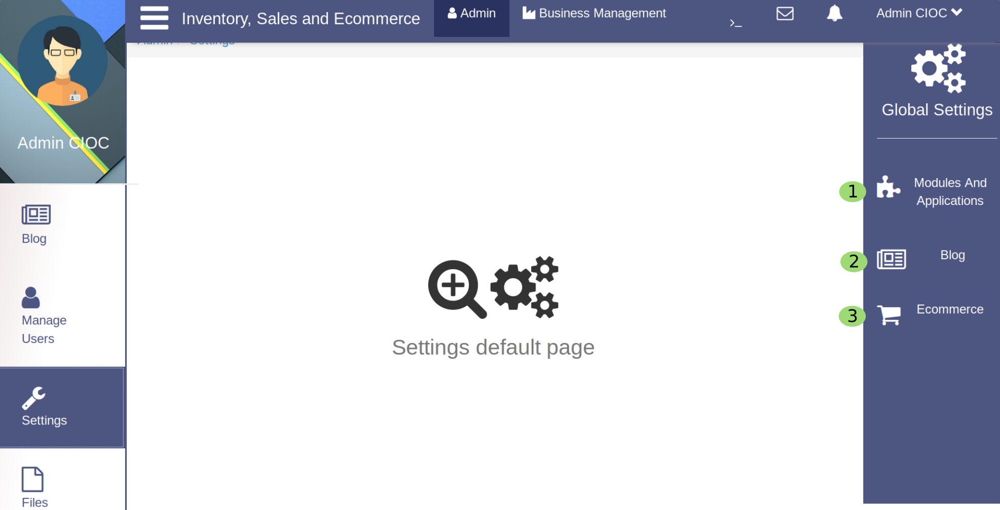
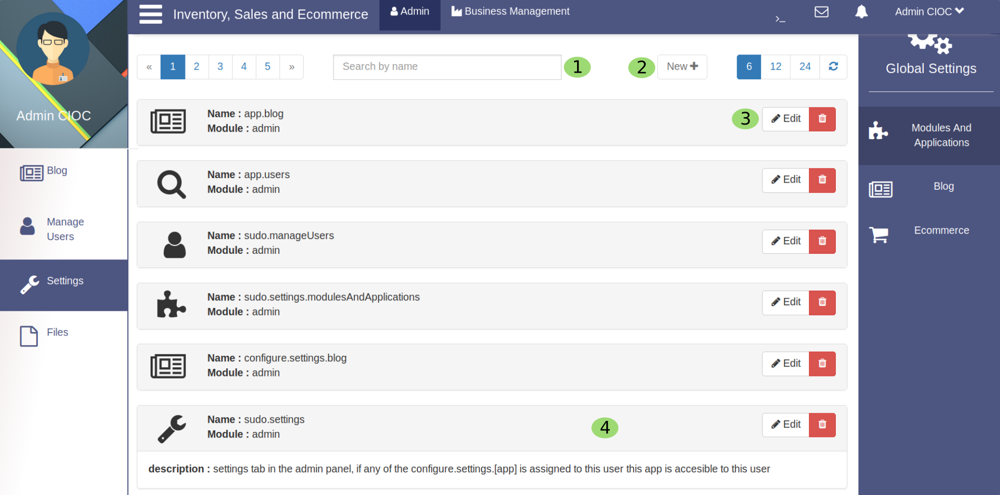
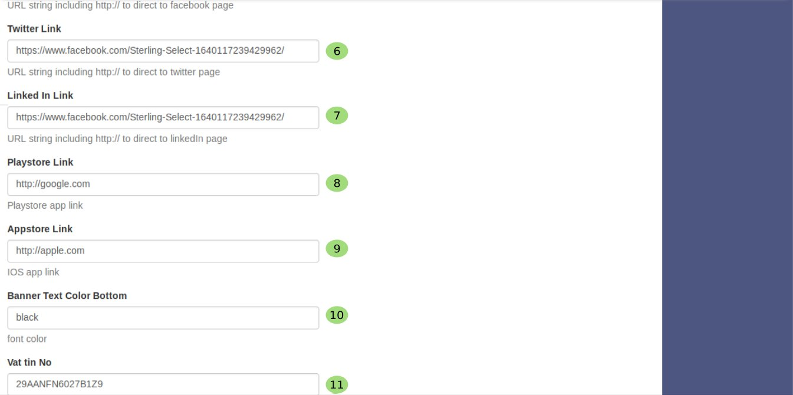
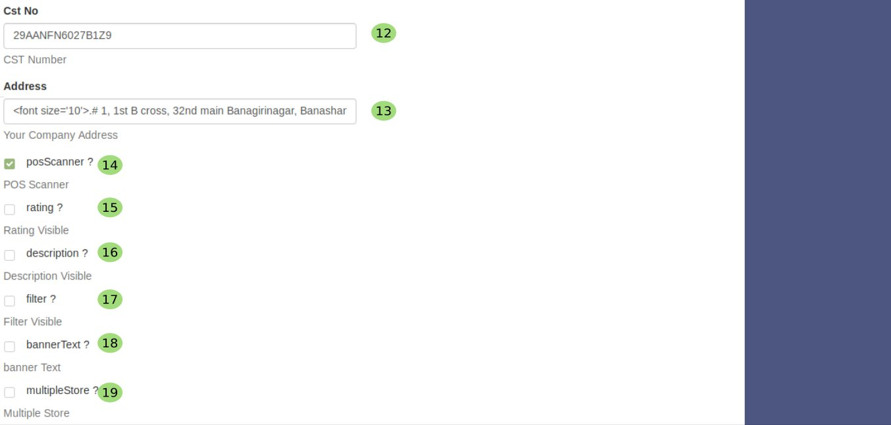
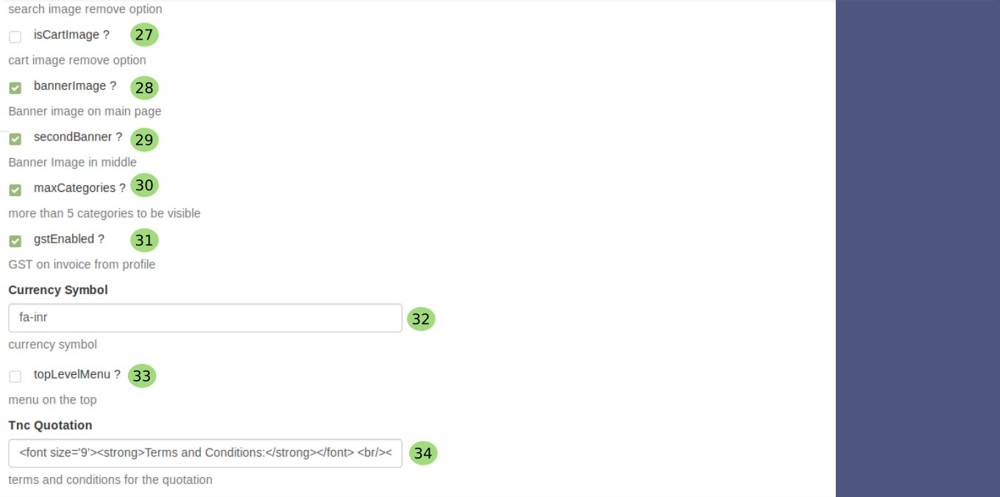
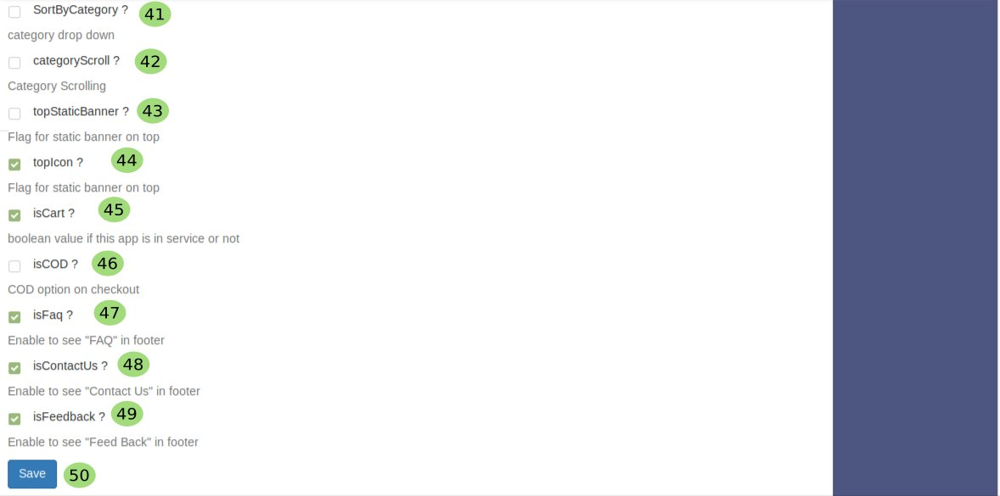

Setting
========

.. _55:

   Configuring Your Website

Now you are on global setting portal you can manage the major part of this site from here.
 
   1. Click here to manage **Modules And Applications** .

.. _56:

   Setting Modules & Applications

Above you are seeing the Modules And Application setting portal here
  
    1. You can search the modules and application here just enter the name of that modules or application and it will be pop up here.
 
    2. Click on **New** to create a new module or applications.

    3. Click here to **Delete or Edit** that particular module and application.

    4. Click on module to see their description.
 
   2. Click here to manage **Blog** .

   3. Click here to manage **Ecommerce** .

.. _57:

Ecommerce Setting
------------------

  .. figure::  images/ecoms1.jpeg
	   :align:   center

Now you reached to subportal of *settting* which is **Ecommerece**, here you will know how easily you can configure your ecommerce setting as per your requirement. Given images is self-explanatory but there is some description too, to make your task easier. 

   1. In this textarea you will fill your **service name**.

   2. In this textarea you will fill the URL or font awesome class of the **logo**.

   3. In this textarea you can fill name of thr **copyright** holder.

   4. In this textarea you can fill the **year of copyright**.

   5. Here you paste your **Facebook page link** (URL string including http:// to direct to facebook page).

For your convenience we are explaining part by part.

there is some more awesome features like:
   
   6. In this textarea you paste your **Twitter link** (URL string including http:// to direct to twitter page).

   7. In this textarea you paste your **Linkedin link** (URL string including http:// to direct to linkedin page).

   8. In this textarea you paste your **Playstore link** (URL string including http:// to direct to Playstore) to download your Android App.

   9. In the same way in this textarea you paste your **Appstore** (URL string including http:// to direct to Appstore).

   10. In this textarea you fill the color name for your banner text's bottom color.

   11. Here you fill your **VAT/TIN Number**. 

there are some more awesome features like:
   
   12. In this textarea you fill the Global Service Tax Number **GST NO**.

   13. Here you will fill the **Address** and you can customise the font size too, just by editing in the **.

   14. This is checkbox for **POS scanner**. if you want to enable the POS scanner in your Ecommerce site.

just check |check| the checkbox. If not then,

.. |uncheck| image:: images/uncheck.png

just uncheck |uncheck| the checkbox. 

   15. If you want to enable the **Rating** feature in your appliation then just check the checkbox if not just leave it unchecked.

   16. If you want to make **Description visible** then check the checkbox else leave it unchecked.

   17. To provide the **Filter** option to your customers just check the checkbox else leave it unchecked.

   18. To show the **Banner Text** on your application just check the checkbox else leave it unchecked.

   19. For **Multiple Store** just check the checkbox else leave it unchecked.

 .. figure::  images/ecoms4.jpeg
	   :align:   center

lets to some more setting.

   20. Here you can customise the **Search** field Textarea.

   21. In this textarea you paste your **Pinterest link** (URL string including http:// to direct to pinterest page). 

   22. Here you fill **Phone Number** of the organisation.

   23. Here you fill **Email** of the organisation.

   24. Do you want to control the **Order limit**, for certain reason, just fill this textarea with numbers as many order you want to allow.

   25. Do you want to enable the option to **Delete POS Product** ? its too easy just check the checkbox else leave it unchecked.

   26. just check this checkbox, it will add one more feature in your application to **Search** some product for customers. 

There are some more awesome features which will make your bussiness easier and organised.
    27. To enable the **Cart** option just check the checkbox if you do not want to provide this option to your customer just uncheck it.

    28. Do you want **Banner Image** on your website ? it is already there, so just check the checkbox. if you don't want just uncheck this checkbox.

    29. you want to show some more banner on your website to make it beautiful and more informative, just check the checkbox. if you don't want just uncheck this checkbox.

    30. If you want to show **maximum category** of your product just check this checkbox, if not, uncheck it then it will show only 5 main category of your products.

    31. If you check this checkbox it will calculate **GST** (global service tax) too, if not  it will calculate simply.

    32. In this textarea just fill the currency symbole code like **fa-inr**,

it will appear |fa-inr|.

    33. If you want to show **Menu on Top** section of website just check this checkbox. if not uncheck it.
 
    34. This textarea will help to change the font size of **T&C** quotation, for this just change the **. 

.. figure::  images/ecoms6.jpeg
	   :align:   center

Some best features are still remaining.

    35. Here you can customise the fonnt of **Invoice**.

    36. Here you fill your **Company Name** and you can customise its font size too just edit ``MONOMERCE``.

    37. you can follow the same process for **Company Address**.

    38. you can follow the same process for **Company Contact Details** as you do for Company Name.

    39. Same for **Bank Details** too.

    40. And same for **Regulatory Details**. in this way you can customise most part of this website.

    

now we reached at the last section of Ecommerce Setting.

    41. If you want to add the feature of **Sort by Category** just check this checkbox it will appear as dropdown for category. if you do not want uncheck it.

    42. You want to enable scrolling for category just check the checkbox of **CategoryScroll** else leave it uncheck.

    43. You want **Static Banner** (Flag for static banner on top) on your site just check the checkbox else uncheck.

    44. If You want **Top Icon** (Flag for static banner on top) on your site just check the checkbox else uncheck.

    45. You want **Cart Service** on your site just check the checkbox else uncheck.

    46. You want **Cash on Delivery** (COD option on checkout) on your site just check the checkbox else uncheck.

    48. You want to Enable to see **Contact Us** in footer just check the checkbox else uncheck.

    49. You want to Enable to see **Feed Back** in footer just check the checkbox else uncheck.

    50. Now you are almost dne with Ecommerce Setting. 

just click on |save| to save your setting and you will get your customise Frontend.

.. toctree::
   :maxdepth: 3
   :caption: Contents:

  
 
   
