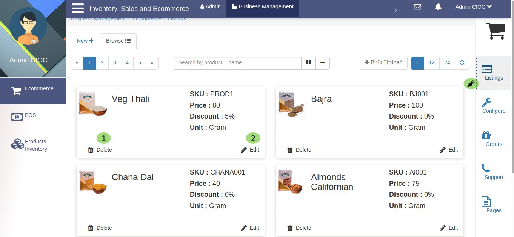
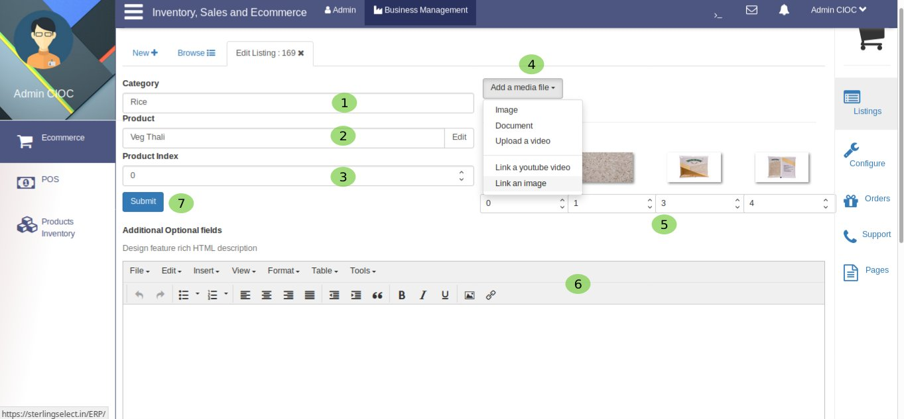
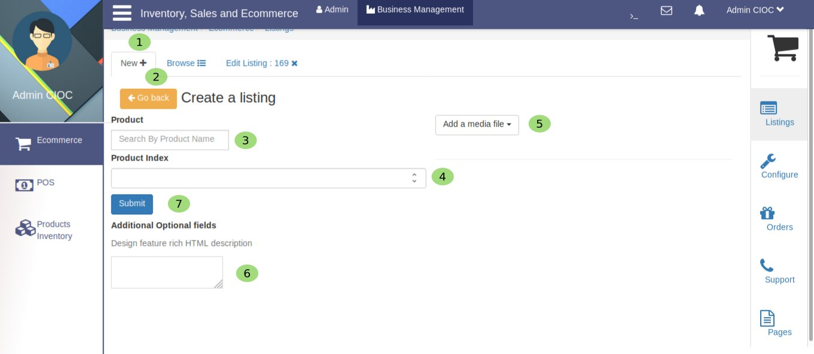
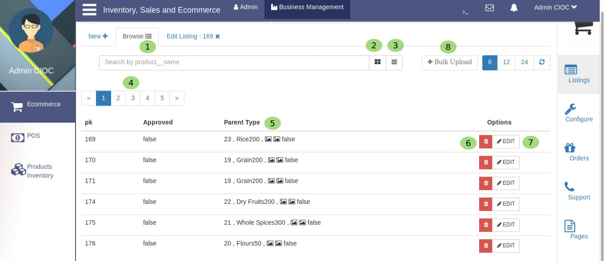
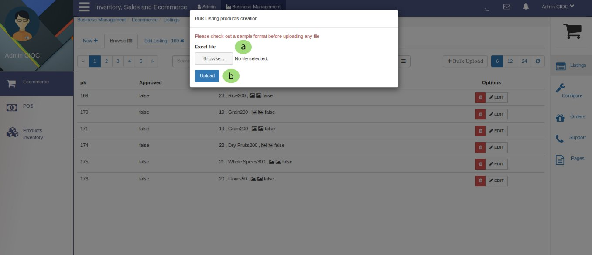

Listing
=======

.. _20:

   Listing Products

By clicking on **Listing** you get the above portal. Here you can
   
   1. **Delete** the product and

   2. **Edit** the product.

.. _21:

    Editing And Creating Products

Here you fill above field to edit.

   1. Fill **Category**.

   2. Edit **Product**.

   3. Set the product **Index**.

   4. Add a media file as per your convenienc e.i *image, document, video or link*.

   5. Here you can do the **Indexing** of your product's image to show different different phase of product.

   6. Here you can write the **Description** for your particular product.

Edit Product
------------

.. _22:

.. figure::  images/editprod.jpeg
   :align:   center
 
   Editing Products

Here you can edit product details like price, description, discount, quantity etc. How ? let's see.
    1. Here you can edit the **Product Name**.

    2. Here you set the **MRP** for this product either by clicking on UP and DOWN arrow symbol or by typing in this textfield.

    3. Here you set the product **Logistics** in same way as for MRP.

    4. Here you set the product **Cost** in same way as for MRP.

    5. Here you set the **Discount Offers** in percentage.

    6. Here you can set the **Display Picture** of product by browsing.
    
    7. Here you set **SKU** (stock keeping unit).
 
    8. Here you set **Serial id** of product.

    9. Here you set **Reorder Threshold** (is the minimum count of an item you keep on hand).
 
    10. In this textarea you fill **Product Meta**.

    11. Here you can specify the **Gross Weight** (Maximum Quantity limit to order for customer).

    12. Here you set the **Unit** of product e.i. *gram, kilogram, liter, milileter* etc.

    13. Here you can set the **How Much** (in unit) for example 500gm, 250gm etc.

    14. To **Save** your edited values you havee click on save button.

    15. Here you can set **Alias** (assumed identity) of your product.

    16. In thid textfield you write the **Description** for product.
  
    17. Here you have one more option to set **Secondary SKU** (stock keeping unit) e.i. *product varient* it will help in product categorization.

    18. Here you set the **Serial Id** for product's category.

    19. Now set **price** in Rupees and paise.

    20. Now click on **Add** button to add your product in category.

    21. Here you can **seach and select** product then

    22. Set the quantity by typing or clicking on given arrows and
  
.. |add| image:: images/add.png

then

    23. Clicking on |add| button to add you product in list. 

.. _23:

  
   Creating List

In Ecommerce's *Listing* Portal

    1. Click on **New** to create a new list.

    2. If you don't want to create list, just click on **Go back** button to return on previous page. if you want to continue then

    3. Fill this textarea with **Product Name** then

    4. Set the product **Index** .

    5. **Add a Media file** for product.

    6. This is optional if you want add some **Description** for product then fill this textarea else leave as it is.

    7. At last click on **Submit** button and your product will be add in list.

.. _24:

   Products list

Here: 
    
    1. you can **Browse** your products.
 
    2. Here you can see the products in  **Grid** view.

    3. By clicking here you will get the **List** view of product same as you are seeing above.

by    4. clicking on |pto| you can chenge the page.

    5. Here you can select items.
  
    6. This gives you **Delete** option.

    7. This gives you **Edit** option Same as we had done on `Edit Product`_ .
  
    8. Here you can upload your product list in **Bulk** just by selecting the Excel file.

.. _25:

   Bulk List creation

Here you:
     
    a. **Browse** your Excel file and 

    b. Click on **Upload** it will save your bulky data in lists just in few clicks.

.. toctree::
   :maxdepth: 2
   :caption: Contents:

