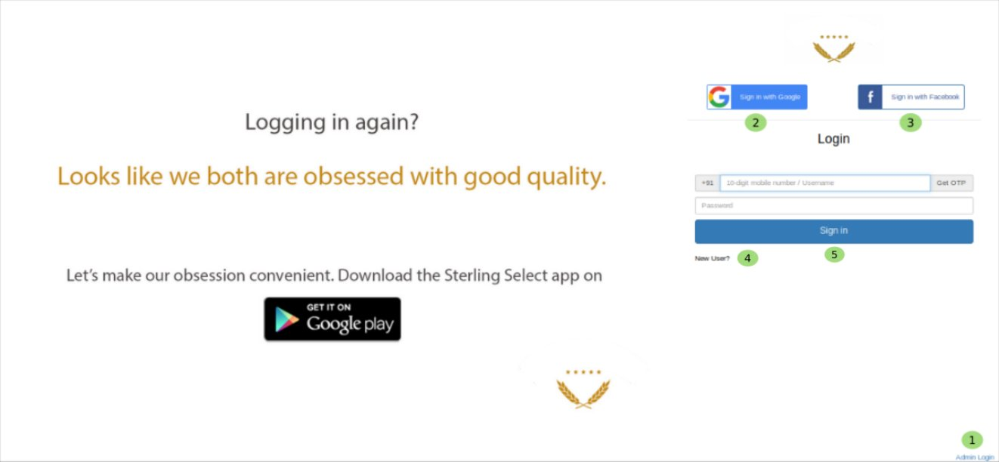

Login
=====

As you entered in the website you have seen some numeric point marked in black over green elipse. For login it is point number 3 click on login then you will see below tab.

.. _13:

    Login Page

Now you are on login page, You can login to this website by choosing one of these three simple way. its all upto you which way you prefer to login.

 These 3 simple ways are :
    1.  **Admin login** which is only for Admin.
    2. By **google account** for this you have to enter your google *userid* or if you are already loged in to google it will automatically login. 
    3. By **facebook** account for this you just enter your facebook id and password if you are already loged in, it will automatically login or by.
    4. Clicking on **new user** which will take you to **Registration Page** so you need register here because you are new user after registration you can login.
    5. One another way is, fill your mobile number in **mobile number/Username** textfield and then click one *Send OTP* you will get an message including OTP enter that 4 digit OTP(one time password)  in your OTP textfield and click on signin and now you are signed in.
    6. To login to website as **Admin** just enter **mobile number/Username** and **Password** and Click on **Signin**

Now you can access the full website.

.. toctree::
   :maxdepth: 2
   :caption: Contents:

   register
   adminlogedin

   
	   
