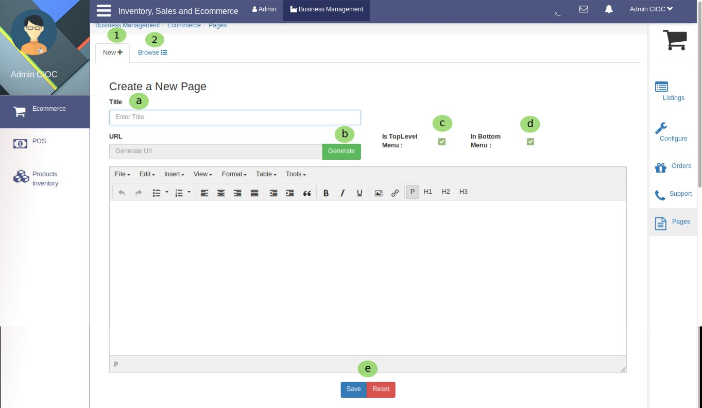
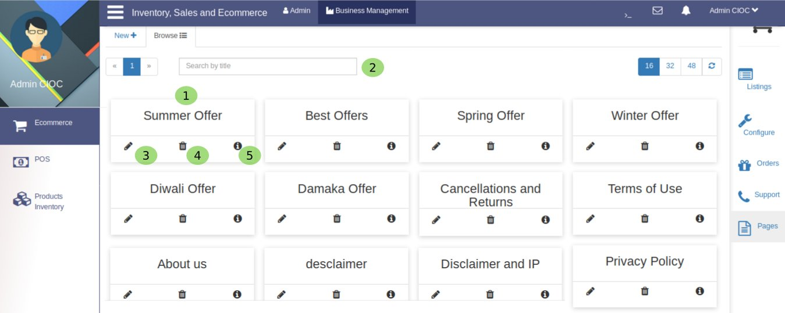
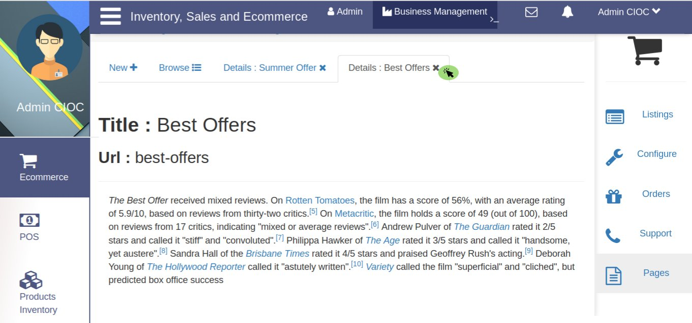

Pages
=====

.. _37:

   Creating several types of pages for your business.

Now you are on Ecommerce's pages portal to configure pages for your website. so let's follow the steps:
 
   1. Click on **New** to create a new page.

Are you wandering how to create page ? Let's see:

     a. Give the **Title** of a new page and

     b. Click on **Generate** button to generate page's URL.
  
     c. Click on the checkbox to appear this page in **Top Level Menu** .
 
     d. Click on the checkbox to appear this page in **Bottom Level Menu** you can enable both too.

     e. Here you have 2 option either you **Save** the page or if you have done any mistake while creating a page then **Reset** it and create again. To save the page click on *save* button and to reset click on *reset* button. yes ! this is that simple.  

   2. Click on **Browse** to browse the created pages.

Above you are seeing the created pages.
 
     1. Here you are seeing the page **Title** for e.g *Summer offer, About Us, Terms of Use, Privacy Policy* etc.

     2. Here you can **Search** your created page *by title* (Page Title) for e.g if you have to check  .

     3. Here you have option to **Edit** the created page its process is same as for *create page* .
 
     4. Here you can see a **Delete** button so you can *delete the page* if you do not want it in your website.

     5. By clicking on this button you can see the **Page Details** as you are seeing below.

.. |close| image:: images/close.png

Once you checked the page click on |close| to close the page.

