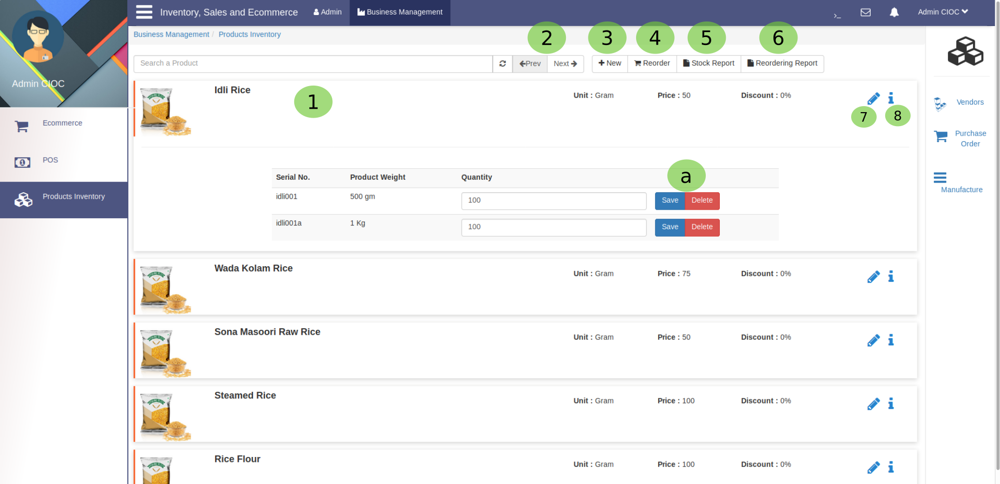
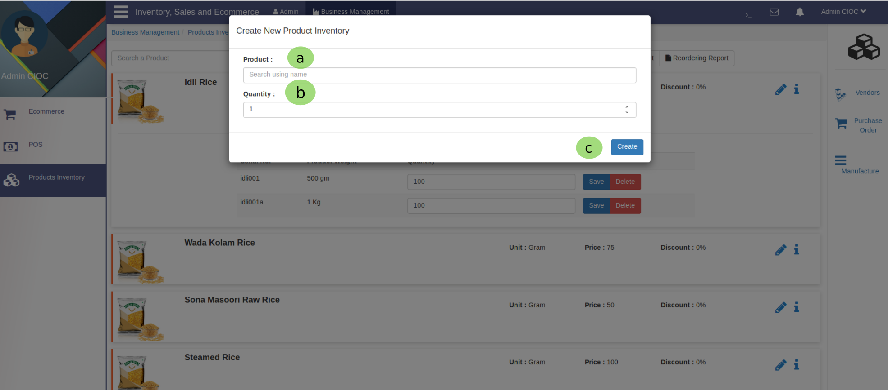
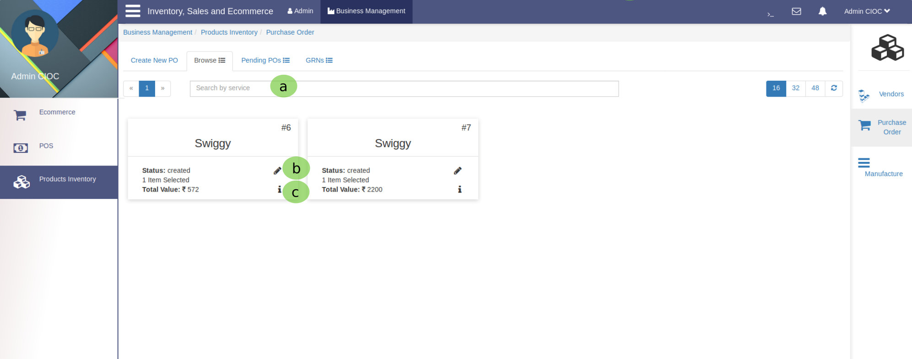
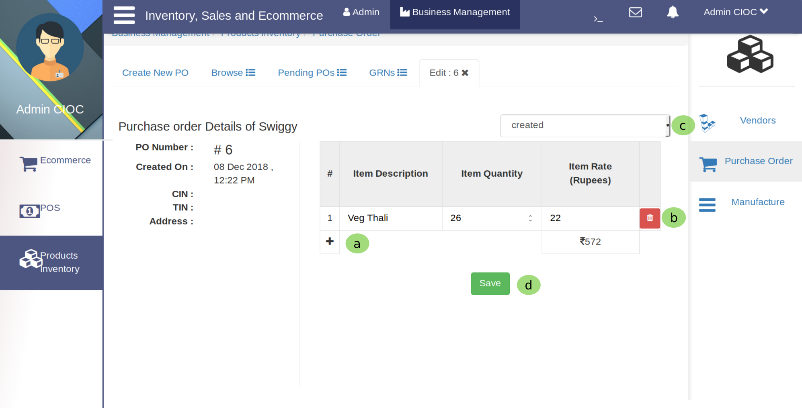
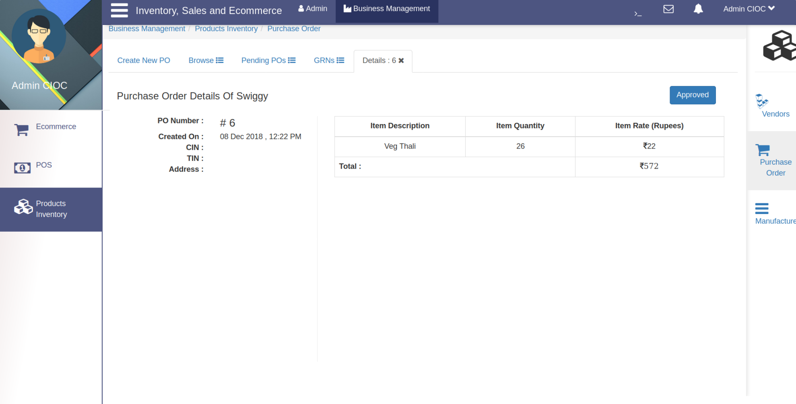
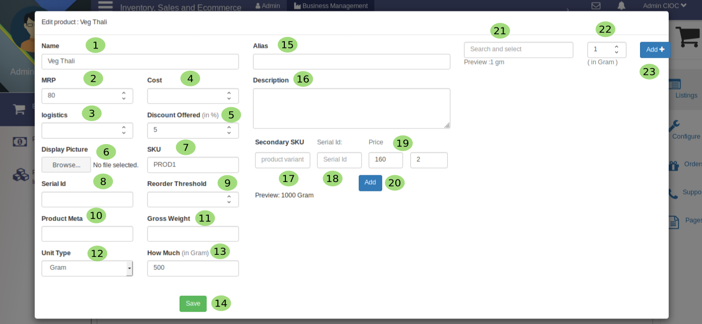
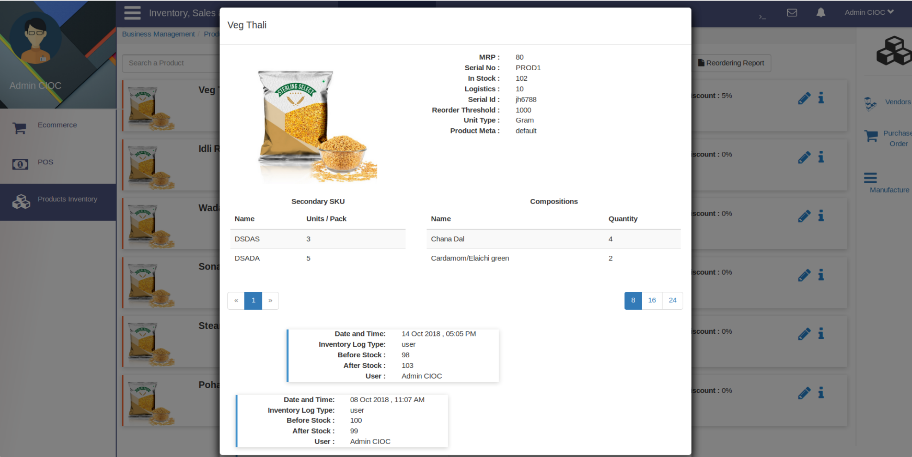
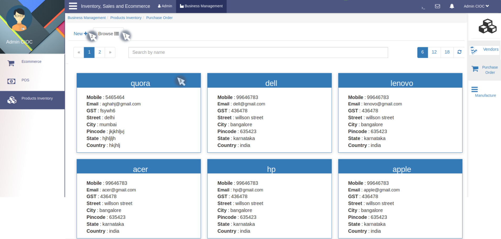
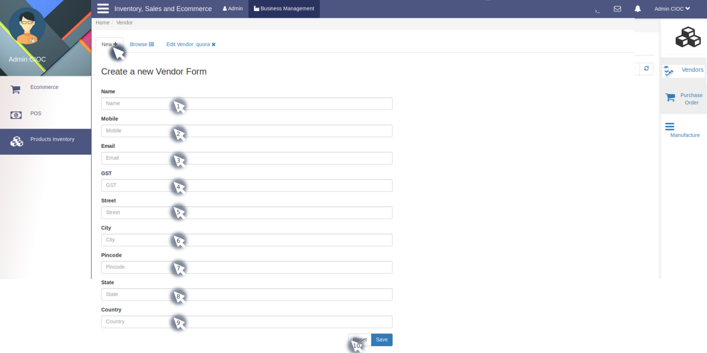
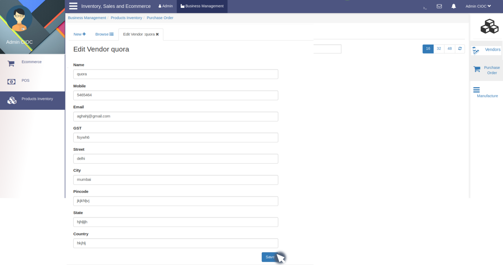

Products Inventory
==================

.. _41:

   Product inventory

As you loged in as admin you will see the **Business Management** click on it then click on **Products Inventory** you will see the above tab
where you can 

    1. Click on any product it will be expand as you can see in the above image.

    2. Here is Refresh, Next, Prev buttons for pages bacause there is lots of products, You can use it as per your convenience.

    3. Click here to create *Product inventory* as you will click here it will show you 

.. _42:
 

   Creating New Inventory

Here 
    
    a. This is a search field type here *product name* and it will give you suggession select that product if it pops up if not simply type the product name here.

    b. Here set the quantity either by *up and down* arrow which is provided in textfield or Type in this textfield.
  
    c. Click on the **Create** button and it will create product inventory.

  4. Click here to check and manage your reorder, When you click on it It will show like

.. _43:

   Reorder/PO

Here 
   
     a. Here you can search and select the product by service means from  where you buy it.

     b. Click on pencil button to edit the order as you click it will show like

.. _44:

   Edit Purchase order

Here you have below options

      a. Here you can add products in your purchase list.

      b. Here you can delete the product.

      c. Here you can change the status.
  
      d. Click on **Save** button and you are done with Managing Reorder.
    
   c.  Click here it will show you purchase order details for service (From where you buy). It will look like 

this image.

   5. Click here it will give you option to download the **Stock Record** in excel sheet format and it will be  shown through supported application in your computer.
 
   6. Here you have same options **Reordering Report** .

   7. Click here to **Edit Product** , it will take you to below  view.

If you don,t know how to edit product click here :ref:`Edit Product` .

   8. Click here to see the product details as you will cilck here it will appear like 

.. _45:

   Product status

Vendor
----------

.. _46:

   Your Vendors

As you can see above this is vendor tab. where you can perform 3 function

   1. You can browse **Vendor** either in the appeared *list* or you can search vendor in *search* bar. 

   2. If you are willing to create new vendor click on **New** and below tab will be open.

.. _47:

   Creating New Vendors

Now let's start creating new vendor.
  
     1. Here fill the **Name** of vendor.

     2. Here fill **Mobile Number** .

     3. Here enter the **Email id** of vendor.

     4. Set the **GST** .

     5. From here onwards keep feeling address of vendor like **Street** .

     6. City  7. Pin code  8. State and  9. Country 
     
     10. Here you have two choice if you had filled wrong data about vendor click on **Reset** else click on **Save** to create new vendor. Now you will see one new vendor in your vendor list.

   3. By clicking on **vendor profile** you can *edit* vendor details.

.. _48:

   Editing Vendor's Info

The above tab is similar to *NEW* tab only differences are there is no *Reset* button and this tab fields are already filled so, you have to just edit some information according to your requirement and click on save so that given information will be updated.
  
     

    

 
    
   

     

